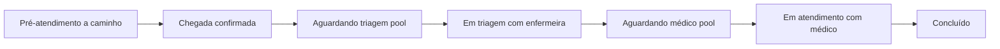

# MedIT — Plataforma digital de apoio à triagem e organização do fluxo hospitalar

Documento de visão do produto e do trabalho acadêmico, alinhado ao repositório **MedIT** (monorepo `frontend` + `backend`). Detalhes de execução, scripts e pré-requisitos estão no [`README.md`](README.md).

## Sumário

- [MedIT neste repositório](#medit-neste-repositório)
- [1. Introdução](#1-introdução)
- [2. Justificativa](#2-justificativa)
- [3. Objetivo geral](#3-objetivo-geral)
- [4. Objetivos específicos](#4-objetivos-específicos)
- [5. Descrição do sistema](#5-descrição-do-sistema)
  - [5.6 Dashboard, período, ocupação e gráficos](#56-dashboard-período-ocupação-e-gráficos)
  - [5.7 Nível MedIT e administrador de unidade](#57-nível-medit-e-administrador-de-unidade)
  - [5.8 Visibilidade de atendimentos por perfil](#58-visibilidade-de-atendimentos-por-perfil)
  - [5.9 Jornada do paciente: pré-atendimento remoto, chegada e filas](#59-jornada-do-paciente-pré-atendimento-remoto-chegada-e-filas)
  - [5.10 Seeds de demonstração (atendimentos e medicamentos)](#510-seeds-de-demonstração-atendimentos-e-medicamentos)
- [6. Arquitetura e stack](#6-arquitetura-e-stack)
- [7. Modelo de atendimento no código](#7-modelo-de-atendimento-no-código)
- [8. Mecanismo inteligente (regras)](#8-mecanismo-inteligente-regras)
- [9. Requisitos funcionais](#9-requisitos-funcionais)
- [10. Requisitos não funcionais](#10-requisitos-não-funcionais)
- [11. Delimitação do projeto](#11-delimitação-do-projeto)
- [12. Estado de implementação no repositório](#12-estado-de-implementação-no-repositório)
- [13. Contribuição esperada](#13-contribuição-esperada)
- [14. Considerações finais](#14-considerações-finais)
- [Contexto acadêmico e autoria](#contexto-acadêmico-e-autoria)

---

## MedIT neste repositório

**MedIT** é a implementação web da proposta: apoio à **organização do fluxo** em unidade, **triagem estruturada**, **histórico** e **consulta de medicamentos**, com **sugestões por regras** (IA simbólica) — sempre como apoio ao profissional, sem diagnóstico automático.

| Camada | Pasta / tecnologia |
|--------|---------------------|
| Apresentação | `frontend/` — React (Vite), TypeScript, Ant Design, Sass, React Router |
| Aplicação e API | `backend/` — Node.js, Express, TypeScript |
| Persistência | MongoDB via Mongoose; modelos em `backend/src/models` e schemas em `backend/src/schema` |
| Segurança | JWT, bcrypt; rotas sob prefixo `/auth/...` |
| Dados sintoma–doença | Coleção `SymptomsDisease`; carga via script em `backend/src/scripts/scripts/createSymptomsDiaseases.script.ts` |

Monorepo na raiz: scripts `yarn dev` (frontend e backend em paralelo), conforme `package.json` da raiz.

---

## 1. Introdução

A rede pública de saúde enfrenta desafios recorrentes relacionados à superlotação, tempo elevado de espera, falta de organização no fluxo de atendimento e dificuldade de acesso a informações sobre disponibilidade de medicamentos. Esses fatores impactam diretamente a qualidade do atendimento e a experiência do paciente.

Com o avanço da transformação digital e a ampliação do acesso à internet e a dispositivos móveis, torna-se possível desenvolver soluções tecnológicas que auxiliem na organização hospitalar, na triagem inicial e na transparência das informações.

Diante desse cenário, propõe-se o desenvolvimento de uma **plataforma digital de apoio à triagem e organização do fluxo hospitalar**, integrada a um **mecanismo inteligente baseado em regras** para sugestão de possíveis condições clínicas, atuando como **ferramenta de apoio à decisão** médica.

O sistema **não substitui** profissionais da saúde; oferece suporte informativo, organizacional e estatístico para melhoria da gestão e do atendimento.

---

## 2. Justificativa

A superlotação nas unidades públicas de saúde é um problema estrutural. Muitos atendimentos poderiam ser melhor organizados se houvesse:

- Digitalização do cadastro e da triagem inicial;
- Organização estruturada do fluxo interno;
- Histórico digital acessível aos profissionais;
- Transparência sobre disponibilidade de medicamentos;
- Apoio inteligente à classificação preliminar de sintomas.

Relevância acadêmica por integrar conceitos de:

- Engenharia de software e arquitetura em camadas;
- Modelagem de banco de dados (documentos relacionais por referência);
- Segurança da informação e controle de acesso;
- IA **simbólica** baseada em regras (sem aprendizado autônomo no escopo);
- Desenvolvimento web full stack;
- LGPD e proteção de dados (como diretriz de desenho; conformidade plena exige processos institucionais fora do escopo de um protótipo).

---

## 3. Objetivo geral

Desenvolver uma plataforma digital web para organização do fluxo hospitalar e apoio à triagem clínica, integrada a um mecanismo inteligente baseado em regras para sugestão de possíveis condições associadas aos sintomas informados.

---

## 4. Objetivos específicos

- Implementar sistema de cadastro digital de pacientes e de usuários por perfil.
- Estruturar organização interna de atendimento hospitalar (unidades, filas, estados do atendimento).
- Permitir acompanhamento do atendimento dentro da unidade.
- Desenvolver módulo de triagem com registro clínico e sinais vitais.
- Implementar mecanismo inteligente de associação sintoma–doença com pontuação determinística.
- Disponibilizar consulta de medicamentos por unidade e gestão de estoque (perfil administrativo).
- Criar dashboard administrativo para indicadores operacionais.
- Garantir autenticação, autorização por nível e boas práticas de segurança em API e cliente.
- Evoluir para **nível MedIT** (acima do administrador de unidade), criação de unidades e administradores, e **isolamento de dados** por unidade e por profissional/paciente.

---

## 5. Descrição do sistema

### 5.1 Visão geral

A plataforma é um **sistema web responsivo** acessível por navegador, com módulos e rotas condicionadas ao **nível de acesso**:

- **Nível MedIT** (planejado) — perfil operacional da **plataforma**, acima do administrador de unidade: cria **unidades** e os **administradores** vinculados a cada unidade. Hoje, no protótipo, o administrador costuma ser criado **diretamente no banco de dados**; a evolução é expor esse fluxo pela aplicação com o nível MedIT.
- **Paciente** — cadastro e jornada de pré-atendimento / acompanhamento.
- **Enfermeiro(a) (triagem)** — sintomas, sinais vitais, classificação de risco, observações.
- **Médico(a)** — histórico, análise de sugestões, diagnóstico, prescrições e orientações (conforme evolução do produto).
- **Administrador(a) de unidade** — gestão operacional e cadastros **somente da sua unidade** (detalhes nas secções 5.7 e 5.8).

O fluxo conceitual prevê **cadastro presencial na unidade** (por exemplo, validação via QR Code) antes de inserção definitiva no fluxo interno; no protótipo, a jornada pode ser exercida com **dados simulados** ou cadastros de teste.

### 5.2 Módulo de cadastro

- Identificação e dados demográficos de contato;
- Alergias e medicamentos em uso (quando aplicável ao modelo de paciente);
- Persistência para reutilização em atendimentos futuros.

### 5.3 Módulo de triagem

A triagem complementa dados clínicos, registra **sinais vitais** (pressão, frequência cardíaca, temperatura, saturação de O₂, etc., conforme modelo), observações e **classificação de risco**.

No repositório, a classificação segue **cinco níveis** compatíveis com uma triagem estruturada (por exemplo, emergência, muito urgente, urgente, pouco urgente, não urgente) — ver [§7](#7-modelo-de-atendimento-no-código).

### 5.4 Módulo clínico (médico)

- Visualização de histórico e do episódio corrente;
- Análise das sugestões do mecanismo de regras;
- Registro de diagnóstico, receita/orientações e solicitação de exames (evolução do escopo funcional).

### 5.5 Consulta de medicamentos

- Disponibilidade por unidade;
- Atualização de estoque pelo painel administrativo;
- Consulta informativa conforme permissões.
- A listagem **parte da própria unidade** do usuário (estoque e cadastro locais).
- Quando um item **não está disponível** na unidade atual, o sistema permite consultar **unidades parceiras** para localizar o medicamento em outro ponto da rede (apenas consulta / encaminhamento informativo, conforme regras de negócio e privacidade).

### 5.6 Dashboard, período, ocupação e gráficos

O **dashboard administrativo** (`frontend/src/pages/Dashboard`, API em `backend/src/controllers/dashboardController.ts` e serviços em `backend/src/services/attendanceService.ts`) consolida indicadores por **unidade** e período.

**Filtro de período e âncora de data**

- O administrador escolhe a **granularidade** (dia, semana, mês, ano) e um **datepicker** que define a **data de referência** (`referenceDate` em `YYYY-MM-DD`), enviada à API junto com `period`.
- O backend usa `getPeriodDateRange(period, referenceDate?)` (`backend/src/utils/getPeriodDateRange.ts`): sem `referenceDate`, o intervalo é o período civil **atual** em `America/Sao_Paulo`; com `referenceDate`, o intervalo é o dia/semana/mês/ano civil que contém essa data. Assim é possível consultar, por exemplo, **semanas anteriores**, não só a semana corrente.

**“Em atendimento”, fila e ocupação (administrador)**

- No código, **`ACTIVE_STATUSES`** agrupa: `waitingTriage`, `inTriage`, `triageCompleted`, `waitingAttendance`, `inAttendance` (não inclui `onTheWay`).
- O cartão **“Em atendimento”** resume **todo o pipeline ativo** (triagem + espera de médico + consulta), não só o enum `inAttendance`.
- **Alinhamento ao período (admin):** `getEntries`, `getAttended`, **`getInAttendance`** e **`getAttendanceOcuppation`** usam o **mesmo** intervalo `[start, end]` de `getPeriodDateRange(period, referenceDate)` e filtram também pelo campo **`date`** (início do atendimento). Assim, **Entradas**, **Em atendimento**, **Atendidos** e **Ocupação** referem-se à **mesma janela temporal** escolhida no dashboard (evita, por exemplo, “24 entradas na semana” versus “39 em atendimento” vindos de contagens incompatíveis).
- **Fila do admin (`attendance-queue`):** o front envia `period` e `referenceDate`; o backend aplica o **mesmo** recorte em `date` só para **nível administrador**, de modo que a lista e o contador da fila batem com o cartão **Em atendimento** naquele período. **Médico** e **enfermeiro** continuam com a fila **operacional** (sem filtro de período): veem todos os casos em espera na unidade, independentemente da âncora do calendário do dashboard.
- A **ocupação** no admin é `round((ocupados / maxOccupancy) * 100)` com `ocupados` contando `ACTIVE_STATUSES` **no período**; `maxOccupancy` vem da unidade (`IUnit`). Valores **acima de 100%** ainda são possíveis se houver mais episódios ativos que vagas nominais.

**Gráfico “Atendimentos por tempo” (`attendance-by-time`)**

- Agrega por `$hour` (dia), `$dayOfWeek` (semana), `$dayOfMonth` (mês) ou `$month` (ano) sobre o campo **`date`** do atendimento no intervalo `[start, end]` retornado por `getPeriodDateRange`.
- Na visão **mês**, o eixo lista os dias **1 … último dia do mês** da âncora; dias **após a data atual** dentro desse mês aparecem com **total 0** porque ainda não existem atendimentos — o intervalo de consulta vai até o fim do mês, mas os dados reais só existem até hoje. Ajuste fino disso seria no backend (cortar `end` em `min(fimDoMês, agora)`); o documento registra o comportamento atual.

**Triagem (cor do risco na UI)**

- As cores dos níveis de risco do componente **RiskTag** estão centralizadas em variáveis CSS em `frontend/src/styles/abstract/variables.scss` (prefixo `--attendance-risk-…`), consumidas pelo `RiskTag` via `var(...)`.

### 5.7 Nível MedIT e administrador de unidade

- **Situação atual (protótipo):** perfis com nível administrativo podem existir sem fluxo completo na UI; em muitos cenários de teste o **administrador é criado diretamente no banco de dados**.
- **Situação desejada:** existe um nível **MedIT** (superior ao administrador de unidade), responsável por:
  - cadastrar e manter **unidades**;
  - criar e associar **administradores** a uma unidade específica.
- **Administrador de unidade:** está ligado a **uma** unidade. Enxerga e gerencia **apenas** o que pertence a essa unidade: atendimentos, médicos, enfermeiros, pacientes no contexto da unidade, medicamentos, dashboard e demais dados operacionais **sem visibilidade cruzada** para outras unidades.

### 5.8 Visibilidade de atendimentos por perfil

- **Administrador de unidade:** acesso a atendimentos e recursos **da sua unidade** (não há escopo global entre unidades).
- **Médico, enfermeiro e paciente:** cada um visualiza **somente os atendimentos em que participa** (vínculo ao próprio usuário / registro profissional). Por exemplo, o **médico A** não pode autenticar-se e listar ou abrir atendimentos atribuídos ao **médico B**; o mesmo princípio vale para enfermeiros e pacientes em relação aos **seus** episódios de cuidado.

Essas regras devem ser aplicadas de forma consistente na **API** (filtros por `unitId`, `doctorId`, `nurseId`, `patientId`, etc.) e na **interface**, evitando vazamento de dados entre unidades ou entre profissionais.

### 5.9 Jornada do paciente: pré-atendimento remoto, chegada e filas

No repositório, a jornada do **paciente** foi desenhada para refletir quem inicia o pedido **fora da unidade** (ex.: cidade vizinha) e só entra na **fila operacional da enfermagem** após confirmação física na unidade:

1. **Pré-atendimento (tela de pré-cadastro)** — O paciente autenticado informa queixa principal, nível de dor, sintomas (tags), dados complementares e a **unidade** de destino (alinhada ao `unitId` do episódio). A API persiste um **atendimento** com status **`onTheWay` (a caminho)**, com histórico inicial em `changesHistory`. Os dados clínicos declarados pelo paciente ficam em **campos próprios na raiz** do documento de atendimento (`painLevel`, `selfMedicated`, `symptomStartDate`, `symptoms`, `conditions`, `allergies`, `generalObservation`, etc.), enquanto **`complaint`** guarda apenas o texto da **queixa principal** (evita monolito textual único).
2. **Dashboard do paciente** — Enquanto existir um atendimento **“a caminho”** do próprio usuário, a interface oferece a ação **“Confirmar chegada ao hospital”**. Ao confirmar, a API valida titularidade e status e promove o episódio para **`waitingTriage` (aguardando triagem)**; a partir daí o caso entra na **fila de triagem** daquela unidade.
3. **Fila da enfermeira (dashboard)** — Lista atendimentos da **mesma `unitId`** da enfermeira, em **`waitingTriage`**, ainda **sem `nurseId`** (pool compartilhado até alguém assumir). A ação **“Iniciar triagem”** chama uma rota que faz **atribuição atômica** (`nurseId` + status **`inTriage`**), evitando dupla captura.
4. **Conclusão da triagem** — A enfermeira responsável encerra a etapa via API; o status passa a **`waitingAttendance`**, liberando o episódio para a **fila médica** (mesmo critério: mesma unidade, sem `doctorId`).
5. **Fila do médico** — Lista **`waitingAttendance`** sem `doctorId`. **“Iniciar atendimento”** atribui **`doctorId`** e **`inAttendance`** de forma atômica.

Rotas de referência no backend: criação e chegada sob **`/auth/patients/...`**; captura de triagem / conclusão de triagem / captura médica sob **`/auth/attendances/...`**. Os contadores do dashboard (ex.: pacientes aguardando triagem ou médico) consideram apenas os itens **ainda não atribuídos** ao profissional, quando aplicável.

### 5.10 Seeds de demonstração (atendimentos e medicamentos)

Documentação detalhada da regra de negócio do seed de atendimentos: [`backend/src/scripts/createAttendances.md`](backend/src/scripts/createAttendances.md).

**Atendimentos (`backend/src/scripts/scripts/createAttendances.script.ts`)**

- Janela rolante ~**365 dias** (meia-noite local) até o instante da execução; `deleteMany` em atendimentos antes de inserir.
- **Teto diário por unidade:** no máximo **30** documentos com o **mesmo dia civil** de `date` (contagem **por unidade**). Meta base diária sorteada entre **15 e 30** (`dailyTarget`); dias anteriores recebem essa quantidade de **concluídos**; o **dia atual** limita concluídos pela fração do dia já decorrida (`elapsedDayFraction`).
- **Ativos (não concluídos):** apenas no **dia da execução** do script; `date` e âncoras de histórico permanecem no “hoje”. Quantidade derivada de uma faixa em torno de **`maxOccupancy`** (fração configurável no script), respeitando o teto do dia.
- **Fluxo completo** no histórico: desde `onTheWay` até `completed`; estados ativos incluem `onTheWay` e `waitingTriage`; `doctorId` omitido em `onTheWay` / `waitingTriage` quando aplicável.
- **Mínimos** por paciente/médico/enfermeiro (ex.: ≥5 concluídos): preenchidos com concluídos extras no **dia civil com menor carga** que ainda tenha vaga; se o teto impedir, o script emite aviso.
- **Top-up global** desligado (`TARGET_MIN_TOTAL_ATTENDANCES = 0`) para não violar o teto diário.
- **Granularidade:** o seed usa **horário local** na montagem dos dias; o dashboard usa **UTC** em `getPeriodDateRange` — pode haver pequeno desvio visual nas bordas do dia entre seed e agregação.

**Medicamentos (`backend/src/scripts/scripts/createMedications.script.ts`)**

- Catálogo **global** em memória + filtros por **perfil** da unidade (UBS, UPA, hospital, especialidades): blocklists de categoria/nome.
- **Por unidade:** embaralhamento **determinístico** a partir do `unitId` + recorte de **fração** do pool permitido (`PROFILE_CATALOG_RATIO`, com piso `MIN_MEDS_PER_UNIT`), de modo que **unidades diferentes** têm **conjuntos e quantidades de itens** distintos.
- **Extras por perfil** (`PROFILE_EXTRA_MEDICATIONS`): itens que só aparecem em UBS, UPA, hospital ou centro de especialidades (ex.: urgência vs. itens de alta complexidade hospitalar).
- **Estoque:** teto efetivo **`effectiveStockRange(unitId, profile)`** multiplica o `max` do perfil por um fator derivado do hash da unidade; sorteio por linha com **jitter**; alguns índices forçados a estoque zero (proporção ~7% do catálogo da unidade). Medicamentos muito sensíveis (ex.: morfina, fentanila, antivenenos) usam faixa proporcional menor.

---

## 6. Arquitetura e stack

Arquitetura em **camadas** e responsabilidades separadas:

```text
Navegador (React + Ant Design)
        │  HTTPS / JSON
        ▼
API REST (Express + TypeScript)
        │
        ▼
MongoDB (Mongoose)
```

- **Apresentação** — `frontend/`: rotas em `src/routes`, páginas em `src/pages`, layout autenticado, integração HTTP (Axios).
- **Aplicação** — `backend/src/controllers`, `middlewares`, `repositories`.
- **Persistência** — schemas e models Mongoose; dados de sintomas/doenças carregados por scripts.
- **Segurança** — JWT nas requisições autenticadas; hash de senha com bcrypt.
- **Inteligência (regras)** — base estruturada `disease` + mapa `symptoms` (pesos 0/1); cálculo de compatibilidade previsto no desenho (integração ponta a ponta com todas as telas em evolução — ver [§12](#12-estado-de-implementação-no-repositório)).

---

## 7. Modelo de atendimento no código

O modelo de **atendimento** (`IAttendance` / `AttendanceSchema`) centraliza o fluxo na unidade:

- **Relacionamentos**: paciente, unidade, enfermeiro(a), médico(a), medicamentos vinculados, referência opcional a condição sugerida pela IA (`iaConditionId`).
- **Sinais vitais** embutidos como subdocumento.
- **Histórico de mudanças de status** em `changesHistory`.
- **Dados do pré-atendimento pelo paciente** (opcionais quando o episódio não passou por essa etapa): campos na **raiz** do documento — por exemplo `painLevel`, `selfMedicated`, `symptomStartDate`, `symptoms[]`, `conditions[]`, `allergies[]`, `generalObservation` — complementam o texto curto da **`complaint`** (queixa principal).

**Status possíveis** (ordem lógica do fluxo): a caminho → aguardando triagem → em triagem → triagem concluída → aguardando atendimento → em atendimento → atendimento concluído / concluído / cancelado (valores exatos nos enums em `backend/src/interfaces/IAttendance.ts` e espelhados no frontend).

**Transições implementadas no protótipo** entre estados chave:

| Etapa | Status (enum) | Quem dispara |
|--------|----------------|--------------|
| Paciente cria pedido à distância | `onTheWay` | API de pré-atendimento do paciente |
| Paciente confirma chegada na unidade | `waitingTriage` | API de confirmação de chegada (paciente titular) |
| Enfermeira assume o caso | `inTriage` (+ `nurseId`) | API de “claim” da triagem |
| Enfermeira libera para o médico | `waitingAttendance` | API de conclusão da triagem |
| Médico assume o caso | `inAttendance` (+ `doctorId`) | API de “claim” da consulta |

Fluxo simplificado (alinhado ao código atual):



---

## 8. Mecanismo inteligente (regras)

1. O paciente (ou o fluxo de triagem) informa **sintomas** estruturados.
2. O sistema consulta a **base sintoma–doença** (documentos com mapa de sintomas e pesos).
3. Um algoritmo **determinístico** calcula compatibilidade (ex.: pontuação por sobreposição com vetor de sintomas da doença).
4. Retorna as condições com **maior correspondência**, ordenadas para apoio à leitura clínica.

**Não há** aprendizado de máquina nem **diagnóstico automatizado**. Trata-se de **IA simbólica baseada em regras** e dados curados (script de seed no backend).

---

## 9. Requisitos funcionais

1. Cadastro digital de pacientes e gestão de usuários por perfil.
2. Inclusão do paciente no fluxo após validação (presencial no cenário real; simulado no TCC).
3. Registro de sintomas e dados de triagem.
4. Classificação de risco em níveis definidos pelo sistema.
5. Mecanismo de associação sintoma–doença baseado em regras e pontuação.
6. Armazenamento de histórico clínico e de episódios de atendimento.
7. Emissão ou registro de orientações e receitas (escopo de produto; implementação progressiva).
8. Consulta e gestão de medicamentos por unidade.
9. Dashboard administrativo (preferencialmente **escopado à unidade** do administrador).
10. Controle de acesso por nível de permissão, incluindo o nível **MedIT** (criação de unidades e administradores) quando implementado.
11. Garantir que **administrador de unidade** só acesse dados da **sua** unidade.
12. Garantir que **médico**, **enfermeiro** e **paciente** só acessem **os próprios** atendimentos (sem leitura entre pares do mesmo nível).
13. Listar medicamentos da **unidade corrente** e permitir consulta a **unidades parceiras** para itens indisponíveis localmente.

---

## 10. Requisitos não funcionais

- Interface web responsiva.
- Tempo de resposta da API adequado ao uso em unidade (meta do projeto: ordem de até ~2 s em operações típicas).
- Disponibilidade dependente de implantação; o desenho visa serviço contínuo.
- Proteção de credenciais e dados sensíveis (HTTPS em produção, segredos em variáveis de ambiente, hash de senhas).
- **Backup** e continuidade: responsabilidade da infraestrutura onde o MongoDB for hospedado (não automatizado apenas pelo código do protótipo).
- Autenticação e autorização consistentes.
- Tratamento de dados pessoais e de saúde alinhado à **LGPD** como requisito de produto; documentação legal e DPIA cabem ao contexto institucional real.
- Arquitetura **modular** (rotas, models, páginas) para evolução e testes.

---

## 11. Delimitação do projeto

- Desenvolvimento como **protótipo funcional** com **dados simulados** ou de demonstração, para fins acadêmicos.
- **Sem integração** com bases reais do SUS ou sistemas legados hospitalares.
- **Não substitui** profissionais da saúde.
- **Não realiza** diagnóstico automatizado; exibe **sugestões** com transparência metodológica limitada ao modelo de regras.

---

## 12. Estado de implementação no repositório

Esta secção amarra a visão do documento ao que já existe no código (ponto em abril de 2026; evolui com o repositório).

**Já presente de forma substantiva**

- API Express com rotas de autenticação, usuários, médicos, enfermeiros, pacientes, unidades, medicamentos e dashboard.
- Frontend com áreas: autenticação, dashboard, pacientes, enfermeiros, médicos, unidades, medicamentos, atendimentos, triagens, pré-cadastro (`PreRegistration`), detalhes de atendimento.
- Modelos Mongoose alinhados ao domínio (atendimento com status, risco, vitais, vínculos).
- Base extensa de **doenças × sintomas** para experimentação do mecanismo de regras (seed no backend).

**Fluxo paciente ⇄ unidade ⇄ triagem ⇄ médico (implementado no código)**

- **Pré-atendimento:** o paciente cria um atendimento via API autenticada (`POST /auth/patients/attendances`), com validação de unidade, atualização opcional de dados cadastrais do paciente e persistência de **queixa** (`complaint`) e **campos estruturados** na raiz do atendimento (dor, sintomas selecionados, automedicação, datas, etc.). O episódio nasce em **`onTheWay`** com registro em `changesHistory`.
- **Chegada na unidade:** `POST /auth/patients/attendances/:attendanceId/confirm-arrival` — apenas o **titular** do atendimento, apenas a partir de **`onTheWay`** → **`waitingTriage`** (+ histórico). No dashboard do paciente, botão dedicado quando há episódio “a caminho”.
- **Filas no dashboard (por `unitId`):** agregações e contadores consideram, para enfermagem, **`waitingTriage` sem `nurseId`**; para o médico, **`waitingAttendance` sem `doctorId`** — ou seja, **pool compartilhado na unidade** até alguém assumir.
- **Vínculo profissional atômico:** `POST /auth/attendances/:id/claim-triage` (enfermeira, mesma unidade), `POST /auth/attendances/:id/complete-triage` (enfermeira dona do caso em `inTriage`), `POST /auth/attendances/:id/claim-consultation` (médico, mesma unidade). Respostas **409** quando o estado já não permite a operação (ex.: outro profissional assumiu primeiro). A UI da fila chama essas rotas antes de navegar ao detalhe do atendimento (enfermeira/médico).
- **Projeções de listagem** de atendimentos (paciente, médico, enfermeiro) passam a incluir os **campos de pré-atendimento** na raiz, para exibição e evolução futura da triagem.

**Dashboard (API + front)**

- Repositório `DashboardRepository`: `getStatusCards` e `getAttendanceByTime` enviam `period` e opcionalmente `referenceDate`; **`getAttendanceQueue`** também envia esses parâmetros para o admin alinhar fila ao período (ver [§5.6](#56-dashboard-período-ocupação-e-gráficos)).
- Cartões de status e gráfico “Atendimentos por tempo” respeitam a âncora descrita em [§5.6](#56-dashboard-período-ocupação-e-gráficos).

**Scripts de seed (`backend/src/scripts/scripts/`)**

- **`createAttendances.script.ts`** — comportamento atual resumido em [§5.10](#510-seeds-de-demonstração-atendimentos-e-medicamentos); especificação editável em [`createAttendances.md`](backend/src/scripts/createAttendances.md).
- **`createMedications.script.ts`** — medicamentos e estoques **variados por unidade** (recorte do catálogo + extras por perfil + teto de estoque efetivo por `unitId`); ver [§5.10](#510-seeds-de-demonstração-atendimentos-e-medicamentos).
- **Detalhe de produto:** na visão mês do gráfico, zeros nos últimos dias do mês corrente podem ser esperados (ver [§5.6](#56-dashboard-período-ocupação-e-gráficos)).

**Em evolução / parcial**

- Algumas telas ainda exibem **dados estáticos** ou mocks enquanto a integração completa com a API é finalizada (ex.: sugestões de condições na UI de detalhes do atendimento podem não refletir ainda o cálculo em tempo real no backend).
- Campos adicionais da triagem (escala de dor, frequência respiratória, etc.) podem ser expandidos além do subdocumento mínimo atual de sinais vitais.
- **Governança multi-unidade:** hoje o administrador pode ser criado **manualmente no banco**; o nível **MedIT**, o vínculo estrito **admin ↔ uma unidade**, o **isolamento de atendimentos** (médico/enfermeiro/paciente só os seus) e a **busca em unidades parceiras** para medicamentos descrevem a **direção do produto** e devem ser reforçados nos middlewares e consultas da API.

Para lista resumida do que o README declara como implementado, ver seção “Funcionalidades” em [`README.md`](README.md).

---

## 13. Contribuição esperada

- Digitalização conceitual do fluxo hospitalar e fila de atendimento.
- Melhoria organizacional e redução de retrabalho na coleta de informações.
- Transparência sobre medicamentos por unidade.
- Demonstração de **IA simbólica** aplicada à saúde, com limites éticos explícitos.
- Evidência de viabilidade técnica de soluções web para a rede pública (como estudo de caso).

---

## 14. Considerações finais

A proposta integra engenharia de software e inteligência artificial aplicada de forma **responsável**: solução estruturada para apoio à organização e à triagem, com ênfase em segurança, usabilidade e **apoio à decisão**, respeitando limites legais e éticos do uso de tecnologia em saúde.

---

## Contexto acadêmico e autoria

Projeto desenvolvido no contexto de **Trabalho de Conclusão de Curso (TCC)** em **Análise e Desenvolvimento de Sistemas**, conforme descrito no [`README.md`](README.md).

Autores listados no repositório: Jonatas Lima, Matheus Chagas, Rafael Silva, Rafael Vieira, Victor Campos (links no README).

Licença do repositório: **MIT**.
