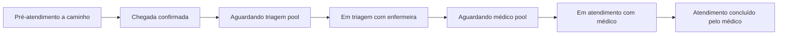

# MedIT — Plataforma digital de apoio à triagem e organização do fluxo hospitalar

Documento de visão do produto e do trabalho acadêmico, alinhado ao repositório **MedIT** (monorepo `frontend` + `backend`). Detalhes de execução, scripts e pré-requisitos estão no [`README.md`](README.md).

## Sumário

- [MedIT neste repositório](#medit-neste-repositório)
- [1. Introdução](#1-introdução)
- [2. Justificativa](#2-justificativa)
- [3. Objetivo geral](#3-objetivo-geral)
- [4. Objetivos específicos](#4-objetivos-específicos)
- [5. Descrição do sistema](#5-descrição-do-sistema)
  - [5.6 Dashboard, período, ocupação e gráficos](#56-dashboard-período-ocupação-e-gráficos)
  - [5.7 Nível MedIT e administrador de unidade](#57-nível-medit-e-administrador-de-unidade)
  - [5.8 Visibilidade de atendimentos por perfil](#58-visibilidade-de-atendimentos-por-perfil)
  - [5.9 Jornada do paciente: pré-atendimento remoto, chegada e filas](#59-jornada-do-paciente-pré-atendimento-remoto-chegada-e-filas)
  - [5.10 Seeds de demonstração (atendimentos e medicamentos)](#510-seeds-de-demonstração-atendimentos-e-medicamentos)
  - [5.11 API de sintomas-doenças e sugestões no atendimento](#511-api-de-sintomas-doenças-e-sugestões-no-atendimento)
  - [5.12 Índice adicional de scripts do backend](#512-índice-adicional-de-scripts-do-backend)
- [6. Arquitetura e stack](#6-arquitetura-e-stack)
  - [6.1 Mapa do repositório (pastas, rotas e cliente)](#61-mapa-do-repositório-pastas-rotas-e-cliente)
- [7. Modelo de atendimento no código](#7-modelo-de-atendimento-no-código)
- [8. Mecanismo inteligente (regras)](#8-mecanismo-inteligente-regras)
- [9. Requisitos funcionais](#9-requisitos-funcionais)
- [10. Requisitos não funcionais](#10-requisitos-não-funcionais)
- [11. Delimitação do projeto](#11-delimitação-do-projeto)
- [12. Estado de implementação no repositório](#12-estado-de-implementação-no-repositório)
- [13. Contribuição esperada](#13-contribuição-esperada)
- [14. Considerações finais](#14-considerações-finais)
- [Contexto acadêmico e autoria](#contexto-acadêmico-e-autoria)

---

## MedIT neste repositório

**MedIT** é a implementação web da proposta: apoio à **organização do fluxo** em unidade, **triagem estruturada**, **histórico** e **consulta de medicamentos**, com **sugestões por regras** (IA simbólica) — sempre como apoio ao profissional, sem diagnóstico automático.

| Camada | Pasta / tecnologia |
|--------|---------------------|
| Apresentação | `frontend/` — React **19**, Vite **7**, TypeScript, Ant Design **6**, Sass, React Router **7**, Axios, ícones **Phosphor** (`@phosphor-icons/react`); `@vercel/analytics` opcional |
| Cliente HTTP | `frontend/src/repositories/` — classes que estendem `Repository` (`Repository.ts`) e consomem a instância Axios `api` (`frontend/src/api/api.ts`, base `VITE_BACKEND_URL`, Bearer + fluxo de **refresh** em interceptor) |
| Aplicação e API | `backend/` — Node.js, **Express 5**, TypeScript, execução dev com **tsx** (`tsx watch src/server.ts`) |
| Persistência | MongoDB via **Mongoose 9**; modelos em `backend/src/models` e schemas em `backend/src/schema`; interfaces em `backend/src/interfaces` |
| Segurança | JWT (access + refresh), bcrypt; rotas de negócio montadas sob prefixo `/auth/...` (ver [§6.1](#61-mapa-do-repositório-pastas-rotas-e-cliente)) |
| Dados sintoma–doença | Coleção `SymptomsDisease`; carga via script em `backend/src/scripts/scripts/createSymptomsDiaseases.script.ts` |

Monorepo na raiz: `package.json` usa **Yarn** e **concurrently** — `yarn dev` instala/atualiza dependências (`yarn base`) e sobe frontend e backend em paralelo (`yarn dev:frontend` / `yarn dev:backend`). Testes de tipo: `yarn test` → `tsc` em cada pacote. Formatação: `yarn format` (Prettier em `frontend` e `backend`). Scripts de banco/dados: `yarn scripts` na raiz (delega a `cd backend && yarn scripts`). Na raiz existem ainda [`CONTRIBUTING.md`](CONTRIBUTING.md) e [`CODE_OF_CONDUCT.md`](CODE_OF_CONDUCT.md).

---

## 1. Introdução

A rede pública de saúde enfrenta desafios recorrentes relacionados à superlotação, tempo elevado de espera, falta de organização no fluxo de atendimento e dificuldade de acesso a informações sobre disponibilidade de medicamentos. Esses fatores impactam diretamente a qualidade do atendimento e a experiência do paciente.

Com o avanço da transformação digital e a ampliação do acesso à internet e a dispositivos móveis, torna-se possível desenvolver soluções tecnológicas que auxiliem na organização hospitalar, na triagem inicial e na transparência das informações.

Diante desse cenário, propõe-se o desenvolvimento de uma **plataforma digital de apoio à triagem e organização do fluxo hospitalar**, integrada a um **mecanismo inteligente baseado em regras** para sugestão de possíveis condições clínicas, atuando como **ferramenta de apoio à decisão** médica.

O sistema **não substitui** profissionais da saúde; oferece suporte informativo, organizacional e estatístico para melhoria da gestão e do atendimento.

---

## 2. Justificativa

A superlotação nas unidades públicas de saúde é um problema estrutural. Muitos atendimentos poderiam ser melhor organizados se houvesse:

- Digitalização do cadastro e da triagem inicial;
- Organização estruturada do fluxo interno;
- Histórico digital acessível aos profissionais;
- Transparência sobre disponibilidade de medicamentos;
- Apoio inteligente à classificação preliminar de sintomas.

Relevância acadêmica por integrar conceitos de:

- Engenharia de software e arquitetura em camadas;
- Modelagem de banco de dados (documentos relacionais por referência);
- Segurança da informação e controle de acesso;
- IA **simbólica** baseada em regras (sem aprendizado autônomo no escopo);
- Desenvolvimento web full stack;
- LGPD e proteção de dados (como diretriz de desenho; conformidade plena exige processos institucionais fora do escopo de um protótipo).

---

## 3. Objetivo geral

Desenvolver uma plataforma digital web para organização do fluxo hospitalar e apoio à triagem clínica, integrada a um mecanismo inteligente baseado em regras para sugestão de possíveis condições associadas aos sintomas informados.

---

## 4. Objetivos específicos

- Implementar sistema de cadastro digital de pacientes e de usuários por perfil.
- Estruturar organização interna de atendimento hospitalar (unidades, filas, estados do atendimento).
- Permitir acompanhamento do atendimento dentro da unidade.
- Desenvolver módulo de triagem com registro clínico e sinais vitais.
- Implementar mecanismo inteligente de associação sintoma–doença com pontuação determinística.
- Disponibilizar consulta de medicamentos por unidade e gestão de estoque (perfil administrativo).
- Criar dashboard administrativo para indicadores operacionais.
- Garantir autenticação, autorização por nível e boas práticas de segurança em API e cliente.
- Evoluir para **nível MedIT** (acima do administrador de unidade), criação de unidades e administradores, e **isolamento de dados** por unidade e por profissional/paciente.

---

## 5. Descrição do sistema

### 5.1 Visão geral

A plataforma é um **sistema web responsivo** acessível por navegador, com módulos e rotas condicionadas ao **nível de acesso**:

- **Nível MedIT** (planejado) — perfil operacional da **plataforma**, acima do administrador de unidade: cria **unidades** e os **administradores** vinculados a cada unidade. Hoje, no protótipo, o administrador costuma ser criado **diretamente no banco de dados**; a evolução é expor esse fluxo pela aplicação com o nível MedIT.
- **Paciente** — cadastro e jornada de pré-atendimento / acompanhamento.
- **Enfermeiro(a) (triagem)** — sintomas, sinais vitais, classificação de risco, observações.
- **Médico(a)** — histórico, análise de sugestões, diagnóstico, prescrições e orientações (conforme evolução do produto).
- **Administrador(a) de unidade** — gestão operacional e cadastros **somente da sua unidade** (detalhes nas secções 5.7 e 5.8).

O fluxo conceitual prevê **cadastro presencial na unidade** (por exemplo, validação via QR Code) antes de inserção definitiva no fluxo interno; no protótipo, a jornada pode ser exercida com **dados simulados** ou cadastros de teste.

### 5.2 Módulo de cadastro

- Identificação e dados demográficos de contato;
- Alergias e medicamentos em uso (quando aplicável ao modelo de paciente);
- Persistência para reutilização em atendimentos futuros.

### 5.3 Módulo de triagem

A triagem complementa dados clínicos, registra **sinais vitais** (pressão, frequência cardíaca, temperatura, saturação de O₂, etc., conforme modelo), observações e **classificação de risco**.

No repositório, a classificação segue **cinco níveis** compatíveis com uma triagem estruturada (por exemplo, emergência, muito urgente, urgente, pouco urgente, não urgente) — ver [§7](#7-modelo-de-atendimento-no-código).

### 5.4 Módulo clínico (médico)

- Visualização de histórico e do episódio corrente;
- Análise das sugestões do mecanismo de regras;
- Registro de diagnóstico, receita/orientações e solicitação de exames (evolução do escopo funcional).

### 5.5 Consulta de medicamentos

- Disponibilidade por unidade;
- Atualização de estoque pelo painel administrativo;
- Consulta informativa conforme permissões.
- A listagem **parte da própria unidade** do usuário (estoque e cadastro locais).
- Quando um item **não está disponível** na unidade atual, o sistema permite consultar **unidades parceiras** para localizar o medicamento em outro ponto da rede (apenas consulta / encaminhamento informativo, conforme regras de negócio e privacidade).
- No modelo `IUnit` / `UnitSchema`, o campo **`partnerUnitIds`** (ObjectIds de outras unidades) materializa essa rede; pode ser preenchido pela interface administrativa ou, em ambientes de demonstração, por scripts de migração (ver [§5.12](#512-índice-adicional-de-scripts-do-backend)).
- Rota de medicamentos no front: **`/auth/units/:unitId/medications`** (constante `ROUTES.MEDICAMENTS` em `frontend/src/routes/constants.ts` — o identificador interno mantém o histórico `MEDICAMENTS`).
- Edição de medicamento no backend: **`PUT /auth/medications/:medicationId`**. A API recalcula `availabilityStatus` com base em `stockQuantity` e **bloqueia edição para paciente**.
- Isolamento por unidade na edição: usuário autenticado só pode editar medicamento cuja `unitId` seja igual à sua `user.unitId`; tentativa cruzada entre unidades retorna **403**.
- Dupla validação no front para edição: o botão **"Editar medicamento"** só aparece quando o item pertence à unidade do usuário logado e, no handler de abertura do modal, há nova checagem defensiva para impedir bypass por estado de tela.

### 5.6 Dashboard, período, ocupação e gráficos

O **dashboard administrativo** (`frontend/src/pages/Dashboard`, API em `backend/src/controllers/dashboardController.ts` e serviços em `backend/src/services/attendanceService.ts`) consolida indicadores por **unidade** e período.

**Filtro de período e âncora de data**

- No header do dashboard (`AuthLayoutHeader`), perfis que não são paciente usam um **único bloco visual** de filtro: `InputSelect` (rótulos em `PeriodsLabels` / valores em `Periods` em `frontend/src/interfaces/globals.ts`) + `InputDashboardPeriodDate` (wrapper em `frontend/src/components/FormComponents/FormComponents.tsx` sobre `MultiDatepicker`). O agrupamento (`periodFilterGroup` em `frontend/src/pages/Dashboard/Dashboard.module.scss`) remove o raio da junção e alinha bordas para parecer **um controle com prefixo de período**; foco no grupo destaca as duas bordas. O `MultiDatepicker` fixa locale/timezone **America/Sao_Paulo** em `dayjs` e usa `getPopupContainer` apontando para `.dashboard__filters--date` para o calendário não ser cortado pelo layout.
- O administrador escolhe a **granularidade** (dia, semana, mês, ano) e um **datepicker** que define a **data de referência** (`referenceDate` em `YYYY-MM-DD`), enviada à API junto com `period`.
- O backend usa `getPeriodDateRange(period, referenceDate?)` (`backend/src/utils/getPeriodDateRange.ts`): sem `referenceDate`, o intervalo é o período civil **atual** em `America/Sao_Paulo`; com `referenceDate`, o intervalo é o dia/semana/mês/ano civil que contém essa data. Assim é possível consultar, por exemplo, **semanas anteriores**, não só a semana corrente.

**“Em atendimento”, fila e ocupação (administrador)**

- No código, **`ACTIVE_STATUSES`** agrupa: `waitingTriage`, `inTriage`, `triageCompleted`, `waitingAttendance`, `inAttendance` (não inclui `onTheWay`).
- O cartão **“Em atendimento”** resume **todo o pipeline ativo** (triagem + espera de médico + consulta), não só o enum `inAttendance`.
- **Alinhamento ao período (admin):** `getEntries`, `getAttended`, **`getInAttendance`** e **`getAttendanceOcuppation`** usam o **mesmo** intervalo `[start, end]` de `getPeriodDateRange(period, referenceDate)` e filtram também pelo campo **`date`** (início do atendimento). Assim, **Entradas**, **Em atendimento**, **Atendidos** e **Ocupação** referem-se à **mesma janela temporal** escolhida no dashboard (evita, por exemplo, “24 entradas na semana” versus “39 em atendimento” vindos de contagens incompatíveis).
- **Fila do admin (`attendance-queue`):** o front envia `period` e `referenceDate`; o backend aplica o **mesmo** recorte em `date` só para **nível administrador**, de modo que a lista e o contador da fila batem com o cartão **Em atendimento** naquele período. **Médico** e **enfermeiro** continuam com a fila **operacional** (sem filtro de período): veem todos os casos em espera na unidade, independentemente da âncora do calendário do dashboard.
- **Modo tela cheia (TV):** no card da fila (`AttendanceQueueChart`), o botão **Tela cheia** abre painel dedicado (fullscreen do navegador quando suportado) para sala de espera: **destaque único** com posição na fila (`dailyNumber`), nome e status; coluna **Próximos**; lateral **Últimos concluídos** (atendimentos com status `attendanceCompleted` no **dia civil** em `America/Sao_Paulo`, via `GET /auth/dashboard/recent-completed-queue?unitId=…`). Sem rolagem no painel; **reconsulta da fila e do histórico a cada 1 minuto** enquanto o modo permanecer aberto. Em perfis **médico** e **enfermeiro**, a API da fila só expõe quem aguarda (`waitingAttendance` / triagem sem enfermeiro); o destaque passa a ser o **próximo** da fila operacional, não o em consulta física.
- A **ocupação** no admin é `round((ocupados / maxOccupancy) * 100)` com `ocupados` contando `ACTIVE_STATUSES` **no período**; `maxOccupancy` vem da unidade (`IUnit`). Valores **acima de 100%** ainda são possíveis se houver mais episódios ativos que vagas nominais.

**Gráfico “Atendimentos por tempo” (`attendance-by-time`)**

- Agrega por `$hour` (dia), `$dayOfWeek` (semana), `$dayOfMonth` (mês) ou `$month` (ano) sobre o campo **`date`** do atendimento no intervalo `[start, end]` retornado por `getPeriodDateRange`.
- Na visão **mês**, o eixo lista os dias **1 … último dia do mês** da âncora; dias **após a data atual** dentro desse mês aparecem com **total 0** porque ainda não existem atendimentos — o intervalo de consulta vai até o fim do mês, mas os dados reais só existem até hoje. Ajuste fino disso seria no backend (cortar `end` em `min(fimDoMês, agora)`); o documento registra o comportamento atual.

**Triagem (cor do risco na UI)**

- As cores dos níveis de risco do componente **RiskTag** estão centralizadas em variáveis CSS em `frontend/src/styles/abstract/variables.scss` (prefixo `--attendance-risk-…`), consumidas pelo `RiskTag` via `var(...)`.

### 5.7 Nível MedIT e administrador de unidade

- **Implementado (ISSUE-0020):** o nível **MedIT** (`UserLevels.MEDIT`) é o **operador da plataforma**, acima do administrador de unidade. Existe **apenas um** usuário MedIT no sistema, criado via script técnico `create-medit-user` (`backend/src/scripts/scripts/createMeditUser.script.ts`), disponível no runner de scripts (`yarn scripts`).
- **Capacidades do nível MedIT:**
  - **Gestão de unidades:** cria, edita e lista **todas** as unidades via rota exclusiva `GET /auth/units/all` e `POST /auth/units` / `PUT /auth/units/:id` (protegidas por `roleMiddleware(UserLevels.MEDIT)`).
  - **Gestão de administradores:** cria, edita e lista administradores de unidade via `GET /auth/users/admins`, `POST /auth/users/admins`, `PUT /auth/users/admins/:id` (restritas ao `medit`). Payload de criação: `name`, `cpf`, `email`, `password`, `unitId`.
  - **Dashboard e fila global:** indicadores do MedIT são **consolidados em todas as unidades** (entradas, em atendimento, atendidos, tempo médio, risco alto). **Não há card de ocupação** ligado a `maxOccupancy` de uma unidade, pois o operador da plataforma não possui unidade. Gráficos e fila aceitam requisição sem `unitId` apenas para o nível `medit`, via parâmetro `level`.
  - **Visão resumida:** a visão global do `medit` expõe dados operacionais sem detalhes clínicos sensíveis.
- **Middleware de autorização:** `backend/src/middlewares/roleMiddleware.ts` valida papéis permitidos nas rotas críticas, retornando **403** quando o nível do usuário não é autorizado.
- **Administrador de unidade:** está ligado a **uma** unidade. Enxerga e gerencia **apenas** o que pertence a essa unidade: atendimentos, médicos, enfermeiros, pacientes no contexto da unidade, medicamentos, dashboard e demais dados operacionais **sem visibilidade cruzada** para outras unidades.

### 5.8 Visibilidade de atendimentos por perfil

- **Administrador de unidade:** acesso a atendimentos e recursos **da sua unidade** (não há escopo global entre unidades).
- **Médico, enfermeiro e paciente:** cada um visualiza **somente os atendimentos em que participa** (vínculo ao próprio usuário / registro profissional). Por exemplo, o **médico A** não pode autenticar-se e listar ou abrir atendimentos atribuídos ao **médico B**; o mesmo princípio vale para enfermeiros e pacientes em relação aos **seus** episódios de cuidado.

Essas regras devem ser aplicadas de forma consistente na **API** (filtros por `unitId`, `doctorId`, `nurseId`, `patientId`, etc.) e na **interface**, evitando vazamento de dados entre unidades ou entre profissionais.

### 5.9 Jornada do paciente: pré-atendimento remoto, chegada e filas

No repositório, a jornada do **paciente** foi desenhada para refletir quem inicia o pedido **fora da unidade** (ex.: cidade vizinha) e só entra na **fila operacional da enfermagem** após confirmação física na unidade, ou **diretamente na unidade** quando não há pré-atendimento pelo celular:

**Presencial na unidade (paciente sem celular):** a enfermeira pode registrar o episódio pelo dashboard com **`POST /auth/attendances/walk-in-triage`**, localizando o paciente por CPF ou criando cadastro com e-mail e senha; o atendimento entra em **`waitingTriage`** na unidade da enfermeira. O documento pode trazer **`openingSource`**, **`openedByUserId`** e **`openedByLevel`** para auditoria de abertura por profissional.

1. **Pré-atendimento (tela de pré-cadastro)** — O paciente autenticado informa queixa principal, nível de dor, sintomas (tags), dados complementares e a **unidade** de destino (alinhada ao `unitId` do episódio). A API persiste um **atendimento** com status **`onTheWay` (a caminho)**, com histórico inicial em `changesHistory`. Os dados clínicos declarados pelo paciente ficam em **campos próprios na raiz** do documento de atendimento (`painLevel`, `selfMedicated`, `symptomStartDate`, `symptoms`, `conditions`, `allergies`, `generalObservation`, etc.), enquanto **`complaint`** guarda apenas o texto da **queixa principal** (evita monolito textual único). **`painLevel`:** validação na API exige número finito em **[0, 10]** (decimais permitidos); **`selfMedicated`** deve ser **boolean** JSON (`true`/`false`), sem coerção a partir de string. **Unicidade de episódio ativo:** não é permitido criar outro pré-atendimento enquanto existir episódio do mesmo paciente em qualquer um dos status `onTheWay`, `waitingTriage`, `inTriage`, `triageCompleted`, `waitingAttendance`, `inAttendance`; a API responde **409** com mensagem clara nesse caso.
2. **Dashboard do paciente** — Enquanto existir um atendimento **“a caminho”** (`onTheWay`) do próprio usuário, a interface oferece a ação **“Confirmar chegada ao hospital”**. Se existir episódio ativo em **outro** status do pipeline acima, a interface **não** oferece nova consulta e informa que já há atendimento em andamento. Ao confirmar a chegada, a API valida titularidade e status e promove o episódio para **`waitingTriage` (aguardando triagem)**; a partir daí o caso entra na **fila de triagem** daquela unidade.
3. **Fila da enfermeira (dashboard)** — Lista atendimentos da **mesma `unitId`** da enfermeira, em **`waitingTriage`**, ainda **sem `nurseId`** (pool compartilhado até alguém assumir). A interface usa **botão único “Iniciar triagem”** (não existe ação por linha), sempre consumindo o **próximo paciente elegível da fila**. A ação chama rota de **atribuição atômica** (`nurseId` + status **`inTriage`**), evitando dupla captura.
4. **Conclusão da triagem** — A enfermeira responsável encerra a etapa via API; o status passa a **`waitingAttendance`**, liberando o episódio para a **fila médica** (mesmo critério: mesma unidade, sem `doctorId`).
5. **Fila do médico** — Lista **`waitingAttendance`** sem `doctorId`. A interface usa **botão único “Iniciar atendimento”** (sem ação por linha), sempre no **próximo paciente elegível da fila**. O claim atribui **`doctorId`** e **`inAttendance`** de forma atômica.

Rotas de referência no backend: criação e chegada sob **`/auth/patients/...`**; abertura presencial pela triagem, captura de triagem / conclusão de triagem / captura médica sob **`/auth/attendances/...`**. Os contadores do dashboard (ex.: pacientes aguardando triagem ou médico) consideram apenas os itens **ainda não atribuídos** ao profissional, quando aplicável.

> **Nota sobre claim/release:** no código atual, o claim é feito **no clique da fila** (`claim-triage` / `claim-consultation`) antes da navegação ao detalhe, evitando dupla captura. Ao tentar sair de `AttendanceDetails` com caso em posse (`inTriage`/`inAttendance`), a UI abre um **modal de confirmação**; confirmando, faz release (`release-triage` / `release-consultation`) em modo *best effort* e retorna ao dashboard. Nesse retorno, a fila é recarregada automaticamente sem precisar F5.

### 5.10 Seeds de demonstração (atendimentos e medicamentos)

Documentação detalhada da regra de negócio do seed de atendimentos: [`backend/src/scripts/createAttendances.md`](backend/src/scripts/createAttendances.md).

**Atendimentos (`backend/src/scripts/scripts/createAttendances.script.ts`)**

- Janela rolante de ~**365 dias** (meia-noite local) ate o instante da execucao; `deleteMany` em atendimentos antes de inserir.
- **Equalizacao diaria (sem spikes):** meta diferenciada por tipo de dia -- dias de semana **[21-26]**, fins de semana **[14-19]** -- com jitter de +/-2 para variacao natural. Teto absoluto **30/dia** por unidade (historico); dia atual usa cap separado de **45** (inclui ativos). Volume estimado: ~**8.400/unidade**, totalizando ~**101k** com 12 unidades.
- **Distribuicao horaria realista:** horas ponderadas -- ~80% dos atendimentos concentrados entre 8h-20h (pico em 9-11h e 14-17h); madrugada com volume minimo.
- **Sinais vitais correlacionados com risco:** emergencia -> temp alta (38.5-40.5 C), FC elevada (110-160), SpO2 baixa (85-93%), PA alta; nao urgente -> valores dentro da normalidade. Nivel de dor (`painLevel`) tambem proporcional ao risco.
- **Dados clinicos completos para apresentacao:** queixa principal mapeada aos sintomas do perfil de doenca (`SYMPTOM_KEY_TO_COMPLAINTS`); ~60% dos concluidos recebem prescricoes de medicamentos (com dosagem, frequencia, duracao); ~40% recebem exames prescritos; disposicao do paciente (`patientDisposition`) correlacionada ao risco; `diagnosisText`, `generalObservation`, `selfMedicated` e `symptomStartDate` preenchidos realisticamente.
- **Membros do TCC com minimos garantidos:** deteccao por email (`{level}.{shortName}@yopmail.com`, short names: brenda, evellin, jota, take, rafa, vieira, victor). Pacientes TCC: >=**10 concluidos**; medicos TCC: >=**8 concluidos** atribuidos + **2 ativos** `IN_ATTENDANCE`; enfermeiros TCC: >=**8 concluidos** atribuidos + **1 ativo** `IN_TRIAGE`. Minimos adicionados ao dia com menor carga.
- **Fila ativa por unidade (dia atual):** **5** `WAITING_TRIAGE` sem `nurseId` (fila do enfermeiro) + **5** `WAITING_ATTENDANCE` sem `doctorId` (fila do medico) + ativos atribuidos para profissionais TCC + ~7 extras variados (ON_THE_WAY, IN_TRIAGE, IN_ATTENDANCE, etc.).
- **Distribuicao justa (round-robin shuffled):** pacientes, enfermeiros e medicos sao atribuidos por round-robin com shuffle previo, garantindo cobertura minima para todos sem concentrar atendimentos em poucos.
- **Fluxo completo** no historico: desde `onTheWay` ate `attendanceCompleted` com timing variavel (+/-30% jitter por passo); `nurseId` omitido em `onTheWay`/`waitingTriage`; `doctorId` omitido ate `inAttendance`.
- **Batches seguros para MongoDB Free:** lotes de **300** com `insertMany(..., { ordered: false, timestamps: false })`; processamento sequencial por unidade.
- **Granularidade:** o seed usa horario local na montagem dos dias; `getPeriodDateRange` devolve `start`/`end` como instantes `Date` em UTC -- ainda pode haver pequeno desvio nas bordas do dia entre seed e agregacao.

**Medicamentos (`backend/src/scripts/scripts/createMedications.script.ts`)**

- Catálogo **global** em memória + filtros por **perfil** da unidade (UBS, UPA, hospital, especialidades): blocklists de categoria/nome.
- **Por unidade:** embaralhamento **determinístico** a partir do `unitId` + recorte de **fração** do pool permitido (`PROFILE_CATALOG_RATIO`, com piso `MIN_MEDS_PER_UNIT`), de modo que **unidades diferentes** têm **conjuntos e quantidades de itens** distintos.
- **Extras por perfil** (`PROFILE_EXTRA_MEDICATIONS`): itens que só aparecem em UBS, UPA, hospital ou centro de especialidades (ex.: urgência vs. itens de alta complexidade hospitalar).
- **Estoque:** teto efetivo **`effectiveStockRange(unitId, profile)`** multiplica o `max` do perfil por um fator derivado do hash da unidade; sorteio por linha com **jitter**; alguns índices forçados a estoque zero (proporção ~7% do catálogo da unidade). Medicamentos muito sensíveis (ex.: morfina, fentanila, antivenenos) usam faixa proporcional menor.

### 5.11 API de sintomas-doenças e sugestões no atendimento

- **`GET /auth/symptoms-diseases/symptom-options`** e **`GET /auth/symptoms-diseases/disease-options`** (com `authMiddleware`) — agregam listas para o cliente (`SymptomsDiseasesRepository`, pré-cadastro do paciente e tela de detalhe do atendimento).
- **Sugestões ligadas ao episódio** (sempre com JWT e escopo pela **mesma `unitId`** do profissional):
  - **`GET /auth/attendances/:attendanceId/suggested-diseases`** — lê `symptoms[]` gravados no atendimento, normaliza chaves com `getReportedSymptomsToDiseaseKeys` e devolve ranqueamento via `suggestDiseasesFromReportedSymptoms` (`backend/src/services/symptomsDiseaseSuggestionService.ts`). Perfis autorizados na API: **médico e enfermeiro** (`staffLevelsSuggest` em `attendanceController.ts`).
  - **`GET /auth/attendances/:attendanceId/suggestion-detail?disease=...`** — detalhe para uma doença da base: compatibilidade, chaves de referência, medicamentos e exames curados no documento `SymptomsDiseases`.
  - **`POST /auth/attendances/:attendanceId/complete-attendance`** — apenas **médico** titular (`doctorId`), com atendimento em **`inAttendance`**; exige **`diagnosisKey`** existente na coleção `SymptomsDiseases`; atualiza para **`attendanceCompleted`**, grava diagnóstico textual opcional, destino do paciente, medicamentos e exames prescritos (listas sanitizadas no controller).
- **Pontuação (regra):** para cada doença, soma-se o peso dos sintomas de referência que coincidem com as chaves derivadas do relato; a compatibilidade é **`round(100 × matchedWeight / totalWeight)`** (pesos ≤0 ignorados no denominador). Limite e piso mínimo configuráveis na função de sugestão (padrão: até 15 resultados, compatibilidade ≥ 1%).
- **Interface:** em `AttendanceDetails`, o painel de sugestões e o `SuggestionDetailModal` são carregados para o perfil **médico** (`getSuggestedDiseases` / `getSuggestionDetail`); a enfermeira usa a mesma tela para triagem e **“Concluir triagem”**, sem consumir a lista de sugestões nessa página (mas a API já permite enfermeiro nas rotas de sugestão, se no futuro a UI quiser reutilizar).

### 5.12 Índice adicional de scripts do backend

Além dos seeds detalhados em [§5.10](#510-seeds-de-demonstração-atendimentos-e-medicamentos), o runner em **`backend/src/scripts/scripts/`** (`yarn scripts`, menu com **`@inquirer/prompts`**) expõe scripts utilitários. Nomes abaixo são os **`name`** registados em cada script (executar só em ambiente consciente; vários assumem dados de demo Sorocaba / IDs fixos).

**Carga e demonstração**

- `create-units`, `create-doctors-by-unit`, `create-nurses-by-unit`, `create-patients-by-unit`, `create-tcc-users`, `create-tcc-admins` — populam unidades, profissionais, pacientes e contas da equipa TCC.
- `create-symptoms-diseases`, `create-attendances`, `create-medications` — base sintoma–doença, episódios e estoque (ver [§5.10](#510-seeds-de-demonstração-atendimentos-e-medicamentos)).

**Vínculos e migrações pontuais**

- `link-units-to-users`, `link-units-to-attendances` — associa `unitId` em utilizadores ou atendimentos.
- `migrate-partner-units` — preenche `partnerUnitIds` por **grupos fixos de ObjectIds** (rede básica e rede de urgência do demo); hospitais/centros de especialidades ficam para parceria manual, conforme comentário no script.
- `migrateUserEnums`, `update-user-levels`, `update-role-to-level` — normalização de enums / níveis legados.

**Correção de dados e enriquecimento**

- `fix-units-data`, `update-address-unit`, `add-zipcode-unit`, `add-doctor-fields`, `add-number-to-attendances`, `add-timestamp-user`, `update-user-numbers`, `backfill-patient-health-data`, `normalize-allergies-conditions`, `normalize-nurses-coren`, `removeAgeProp`.

---

## 6. Arquitetura e stack

Arquitetura em **camadas** e responsabilidades separadas:

```text
Navegador (React + Ant Design)
        │  HTTPS / JSON
        ▼
API REST (Express + TypeScript)
        │
        ▼
MongoDB (Mongoose)
```

- **Apresentação** — `frontend/`: rotas em `src/routes`, páginas em `src/pages`, layout autenticado, integração HTTP (Axios).
- **Aplicação** — `backend/src/controllers`, `middlewares`, `repositories`.
- **Persistência** — schemas e models Mongoose; dados de sintomas/doenças carregados por scripts.
- **Segurança** — JWT nas requisições autenticadas; hash de senha com bcrypt.
- **Inteligência (regras)** — base estruturada `disease` + mapa `symptoms` (pesos 0/1); cálculo de compatibilidade previsto no desenho (integração ponta a ponta com todas as telas em evolução — ver [§12](#12-estado-de-implementação-no-repositório)).

### 6.1 Mapa do repositório (pastas, rotas e cliente)

**Backend — `backend/src/`**

- **`server.ts`** — sobe Express após `connectDatabase()`; `cors()` + `express.json()`; montagem de rotas (todas abaixo partindo da raiz configurada no cliente).
- **Rotas HTTP** (arquivos em `routes/`, importados em `server.ts`):
  - `POST /auth/login`, `POST /auth/refresh`, `POST /auth/logout`; `GET /auth/signup/units` (lista de unidades para cadastro) — `authRoutes`.
  - `/auth/users` — `usersRoutes`; `/auth/doctors` — `doctorsRoutes`; `/auth/nurses` — `nursesRoutes`; `/auth/patients` — `patientsRoutes` (`POST /` cria paciente **sem** JWT; rotas autenticadas: pré-atendimento, chegada, listagens, `GET /lookup-by-cpf` restrito a enfermeiro para preenchimento do modal presencial, etc.); `/auth/units` — `unitsRoutes`; `/auth/dashboard` — `dashboardRoutes` (cards, fila, gráfico por tempo); `/auth/attendances` — `attendancesRoutes` (ver [§5.11](#511-api-de-sintomas-doenças-e-sugestões-no-atendimento) e [§7](#7-modelo-de-atendimento-no-código)); `/auth/medications` — `medicationRoutes`; **`/auth/symptoms-diseases`** — `symptomsDiseasesRoutes` (`symptom-options`, `disease-options`).
- **`controllers/`** — handlers finos que chamam serviços ou modelos.
- **`services/`** — regras e agregações mais pesadas (ex.: `attendanceService.ts` para contagens do dashboard, filas e recortes por período).
- **`middlewares/authMiddleware.ts`** — validação JWT na maioria dos handlers sob `/auth/...`; **sem** middleware em `login`, `refresh`, `logout` e `GET /auth/signup/units` (rotas públicas definidas em `authRoutes`).
- **`models/` + `schema/`** — definição Mongoose; **`interfaces/`** — tipos compartilhados com o domínio.
- **`utils/`** — utilitários (`getPeriodDateRange.ts`: intervalos como objetos **`Date`** em UTC para consultas; “hoje” sem âncora a partir de **America/Sao_Paulo**; ver [§5.10](#510-seeds-de-demonstração-atendimentos-e-medicamentos)); `getReportedSymptomsToDiseaseKeys.ts` — normalização de sintomas reportados para chaves da base de regras.
- **`config/database.ts`** — conexão MongoDB (`MONGO_URL` em `.env`).
- **`globals/Config.ts`** — `PORT`, `MONGO_URL`, segredos JWT a partir de `process.env`.
- **`scripts/`** — `runner.ts` descobre automaticamente todos os `*.script.ts` / `*.script.js` em `scripts/scripts/`, exportados como `default` com metadados (`Script` em `scripts/types.ts`). Execução: `yarn scripts` no backend (ou via raiz); argumento CLI executa script por nome; sem argumento, menu interativo (**`@inquirer/prompts`**). Índice resumido dos nomes em [§5.12](#512-índice-adicional-de-scripts-do-backend).

**Frontend — `frontend/src/`**

- **`main.tsx`** — monta a árvore React, providers (Ant Design, auth).
- **`routes/AppRoutes.tsx`** — **React Router**; rotas públicas em `/` (SignIn/SignUp com `UnauthRoute`) vs área autenticada em `/auth` com `AuthRoute` e `AuthLayout`; `pages/routerPages` centraliza exports das páginas.
- **`routes/constants.ts`** — objeto `ROUTES` (paths) usado na navegação e no menu.
- **`repositories/`** — um arquivo por agregado (`AuthRepository`, `DashboardRepository`, `PatientsRepository`, `AttendancesFlowRepository`, `MedicationsRepository`, `UnitsRepository`, `DoctorsRepository`, `NursesRepository`, `UserRepository`, **`SymptomsDiseasesRepository`**); padrão `extends Repository` + método `handle()` para extrair `data` da resposta Axios.
- **`api/api.ts`** — instância Axios, interceptors de **Authorization** e **renovação de token** em `401` (refresh + retry; falha redireciona para `/`).
- **`contexts/`** — `AuthProvider` / `useAuth` (token, usuário, nível `UserLevels`); config global do Ant Design.
- **`hooks/`** — hooks reutilizáveis (`useAuth`, colunas de tabelas por página em `pages/.../hooks`).
- **`pages/`** — telas por domínio (`Dashboard` com `AttendanceByTimeChart`, `AttendanceQueueChart` e variantes admin/médico/enfermeiro; `PreRegistration`; `AttendanceDetails` compartilhado com triagens; CRUDs de médicos, enfermeiros, pacientes, unidades, medicamentos; listagens de atendimentos).
- **`components/`** — UI transversal (`FormComponents`, `MultiDatepicker`, `ListTable`, `SideBar`, `AuthLayoutHeader`, `RiskTag` / constantes de risco, etc.).
- **`components/SideBar/.../ConfigModal`** — modal de configuração do usuário com visualização e autoedição dos dados válidos por perfil (nome, contato, dados profissionais/paciente e alteração de senha com `currentPassword` + `newPassword`).
- **`helpers/handleApiError.ts`** — tratamento uniforme de erros de API (mensagens ao utilizador).
- **`interfaces/`** — tipos alinhados ao backend (`IAttendance`, `IUser`, `IDashboard`, `Periods`, etc.).

**Gráfico de fila no dashboard**

- `AttendanceQueueChart.tsx` orquestra subcomponentes em `AttendanceQueueChart/components/` — **Admin**, **Doctor**, **Nurse** — com estilos em `AttendanceQueueChart.module.scss`; o admin consome a API com `period` + `referenceDate` alinhados aos cartões (ver [§5.6](#56-dashboard-período-ocupação-e-gráficos)).

---

## 7. Modelo de atendimento no código

O modelo de **atendimento** (`IAttendance` / `AttendanceSchema`) centraliza o fluxo na unidade:

- **Relacionamentos**: paciente, unidade, enfermeiro(a), médico(a), medicamentos vinculados.
- **Sinais vitais** embutidos como subdocumento.
- **Histórico de mudanças de status** em `changesHistory`.
- **Dados do pré-atendimento pelo paciente** (opcionais quando o episódio não passou por essa etapa): campos na **raiz** do documento — por exemplo `painLevel`, `selfMedicated`, `symptomStartDate`, `symptoms[]`, `conditions[]`, `allergies[]`, `generalObservation` — complementam o texto curto da **`complaint`** (queixa principal).

**Status possíveis** (ordem lógica do fluxo): a caminho → aguardando triagem → em triagem → triagem concluída → aguardando atendimento → em atendimento → atendimento concluído (valores exatos nos enums em `backend/src/interfaces/IAttendance.ts` e espelhados no frontend).

**Transições implementadas no protótipo** entre estados chave:

| Etapa | Status (enum) | Quem dispara |
|--------|----------------|--------------|
| Paciente cria pedido à distância | `onTheWay` | API de pré-atendimento do paciente |
| Paciente confirma chegada na unidade | `waitingTriage` | API de confirmação de chegada (paciente titular) |
| Enfermeira assume o caso | `inTriage` (+ `nurseId`) | API de “claim” da triagem |
| Enfermeira libera para o médico | `waitingAttendance` | API de conclusão da triagem |
| Médico assume o caso | `inAttendance` (+ `doctorId`) | API de “claim” da consulta |
| Médico finaliza o episódio | `attendanceCompleted` (+ diagnóstico / prescrições conforme payload) | `POST .../complete-attendance` (titular, a partir de `inAttendance`) |

Fluxo simplificado (alinhado ao código atual):



---

## 8. Mecanismo inteligente (regras)

1. O paciente (ou o fluxo de triagem) informa **sintomas** estruturados (chaves alinhadas à base).
2. O sistema consulta a **base sintoma–doença** (`SymptomsDiseases` / `SymptomsDiseasesModel`): cada doença possui um mapa `symptoms` (pesos numéricos; valores ≤0 não entram no denominador da pontuação).
3. O serviço **`symptomsDiseaseSuggestionService.ts`** aplica regra **determinística**: para cada doença, **compatibilidade em %** = soma dos pesos dos sintomas de referência que coincidem com as chaves derivadas do relato, dividida pela soma dos pesos positivos da doença, arredondada (`scoreDisease`). Empate desempata por nome (`pt`).
4. A API expõe listas para o cliente, ranqueamento por episódio e detalhe por doença (ver [§5.11](#511-api-de-sintomas-doenças-e-sugestões-no-atendimento)); o encerramento médico valida **`diagnosisKey`** contra o mesmo catálogo.

**Não há** aprendizado de máquina nem **diagnóstico automatizado**. Trata-se de **IA simbólica baseada em regras** e dados curados (script `create-symptoms-diseases` no backend).

---

## 9. Requisitos funcionais

1. Cadastro digital de pacientes e gestão de usuários por perfil.
2. Inclusão do paciente no fluxo após validação (presencial no cenário real; simulado no TCC).
3. Registro de sintomas e dados de triagem.
4. Classificação de risco em níveis definidos pelo sistema.
5. Mecanismo de associação sintoma–doença baseado em regras e pontuação.
6. Armazenamento de histórico clínico e de episódios de atendimento.
7. Emissão ou registro de orientações e receitas (escopo de produto; implementação progressiva).
8. Consulta e gestão de medicamentos por unidade.
9. Dashboard administrativo (preferencialmente **escopado à unidade** do administrador).
10. Controle de acesso por nível de permissão, incluindo o nível **MedIT** (criação de unidades e administradores) quando implementado.
11. Garantir que **administrador de unidade** só acesse dados da **sua** unidade.
12. Garantir que **médico**, **enfermeiro** e **paciente** só acessem **os próprios** atendimentos (sem leitura entre pares do mesmo nível).
13. Listar medicamentos da **unidade corrente** e permitir consulta a **unidades parceiras** para itens indisponíveis localmente.

---

## 10. Requisitos não funcionais

- Interface web responsiva.
- Tempo de resposta da API adequado ao uso em unidade (meta do projeto: ordem de até ~2 s em operações típicas).
- Disponibilidade dependente de implantação; o desenho visa serviço contínuo.
- Proteção de credenciais e dados sensíveis (HTTPS em produção, segredos em variáveis de ambiente, hash de senhas).
- **Backup** e continuidade: responsabilidade da infraestrutura onde o MongoDB for hospedado (não automatizado apenas pelo código do protótipo).
- Autenticação e autorização consistentes.
- Tratamento de dados pessoais e de saúde alinhado à **LGPD** como requisito de produto; documentação legal e DPIA cabem ao contexto institucional real.
- Arquitetura **modular** (rotas, models, páginas) para evolução e testes.

---

## 11. Delimitação do projeto

- Desenvolvimento como **protótipo funcional** com **dados simulados** ou de demonstração, para fins acadêmicos.
- **Sem integração** com bases reais do SUS ou sistemas legados hospitalares.
- **Não substitui** profissionais da saúde.
- **Não realiza** diagnóstico automatizado; exibe **sugestões** com transparência metodológica limitada ao modelo de regras.

---

## 12. Estado de implementação no repositório

Esta secção amarra a visão do documento ao que já existe no código (ponto em **abril de 2026**; evolui com o repositório). Para árvore de ficheiros e rotas HTTP, ver também [§6.1](#61-mapa-do-repositório-pastas-rotas-e-cliente).

**Já presente de forma substantiva**

- API Express com rotas de autenticação, usuários, médicos, enfermeiros, pacientes, unidades, medicamentos e dashboard.
- Frontend com áreas: autenticação, dashboard, pacientes, enfermeiros, médicos, unidades, medicamentos, atendimentos, triagens, pré-cadastro (`PreRegistration`), detalhes de atendimento.
- Páginas de detalhe de usuários (`DoctorDetails`, `NursesDetails`, `PatientsDetails`) com fallback seguro para **sem atendimentos**: o card "Último Atendimento" exibe "Sem atendimentos registrados" sem `TypeError`, e sinais vitais ausentes não mostram `undefined`.
- Modelos Mongoose alinhados ao domínio (atendimento com status, risco, vitais, vínculos).
- Base extensa de **doenças × sintomas** para experimentação do mecanismo de regras (seed no backend).

**Fluxo paciente ⇄ unidade ⇄ triagem ⇄ médico (implementado no código)**

- **Pré-atendimento:** o paciente cria um atendimento via API autenticada (`POST /auth/patients/attendances`), com validação de unidade, atualização opcional de dados cadastrais do paciente e persistência de **queixa** (`complaint`) e **campos estruturados** na raiz do atendimento (dor, sintomas selecionados, automedicação, datas, etc.). O episódio nasce em **`onTheWay`** com registro em `changesHistory`.
- **Chegada na unidade:** `POST /auth/patients/attendances/:attendanceId/confirm-arrival` — apenas o **titular** do atendimento, apenas a partir de **`onTheWay`** → **`waitingTriage`** (+ histórico). No dashboard do paciente, botão dedicado quando há episódio “a caminho”.
- **Filas no dashboard (por `unitId`):** agregações e contadores consideram, para enfermagem, **`waitingTriage` sem `nurseId`**; para o médico, **`waitingAttendance` sem `doctorId`** — ou seja, **pool compartilhado na unidade** até alguém assumir.
- **Vínculo profissional atômico:** `POST /auth/attendances/:id/claim-triage` (enfermeira, mesma unidade), `POST /auth/attendances/:id/complete-triage` (enfermeira dona do caso em `inTriage`), `POST /auth/attendances/:id/claim-consultation` (médico, mesma unidade). Respostas **409** quando o estado já não permite a operação (ex.: outro profissional assumiu primeiro). **Estado atual no código:** o claim acontece de forma **lazy**, dentro de `AttendanceDetails` no momento de "Concluir triagem" / "Finalizar atendimento" (e não no clique do botão da fila). **Evolução planejada:** mover o claim para o clique da fila e adicionar rotas `release-triage` / `release-consultation` para devolver ao pool quando o profissional sai do detalhe sem concluir — ver `.issues/ISSUE-006-claim-nao-feito-na-fila.md`.
- **Sugestões e fecho clínico:** na página `AttendanceDetails`, o **médico** obtém sugestões em tempo real via **`getSuggestedDiseases`** / **`getSuggestionDetail`** e finaliza o caso com **`complete-attendance`** (modal com diagnóstico obrigatório da base, prescrições e exames). Ver [§5.11](#511-api-de-sintomas-doenças-e-sugestões-no-atendimento).
- **Projeções de listagem** de atendimentos (paciente, médico, enfermeiro) passam a incluir os **campos de pré-atendimento** na raiz, para exibição e evolução futura da triagem.

**Dashboard (API + front)**

- Repositório `DashboardRepository`: `getStatusCards` e `getAttendanceByTime` enviam `period` e opcionalmente `referenceDate`; **`getAttendanceQueue`** também envia esses parâmetros para o admin alinhar fila ao período (ver [§5.6](#56-dashboard-período-ocupação-e-gráficos)).
- Cartões de status e gráfico “Atendimentos por tempo” respeitam a âncora descrita em [§5.6](#56-dashboard-período-ocupação-e-gráficos).
- UI do filtro: grupo compacto período + data no header (ver bullet inicial de [§5.6](#56-dashboard-período-ocupação-e-gráficos)); botão `ReloadButton` ao lado dispara revalidação manual dos dados exibidos.

**Scripts de seed (`backend/src/scripts/scripts/`)**

- **`createAttendances.script.ts`** — comportamento atual resumido em [§5.10](#510-seeds-de-demonstração-atendimentos-e-medicamentos); especificação editável em [`createAttendances.md`](backend/src/scripts/createAttendances.md).
- **`createMedications.script.ts`** — medicamentos e estoques **variados por unidade** (recorte do catálogo + extras por perfil + teto de estoque efetivo por `unitId`); ver [§5.10](#510-seeds-de-demonstração-atendimentos-e-medicamentos).
- **Outros scripts** — catálogo por nome em [§5.12](#512-índice-adicional-de-scripts-do-backend).
- **Detalhe de produto:** na visão mês do gráfico, zeros nos últimos dias do mês corrente podem ser esperados (ver [§5.6](#56-dashboard-período-ocupação-e-gráficos)).

**Triagem — sinais vitais editáveis pela enfermeira**

- O componente `VitalCard` (`frontend/src/pages/AttendanceDetails/components/VitalCard/VitalCard.tsx`) é um componente **controlado**: o valor exibido vem diretamente da prop `value` e alterações chamam `onChange` imediatamente (sem estado interno). A prop **`field`** (chave alinhada a `VitalFieldDraft` em `IAttendance.ts`) define máscaras de entrada; o **`label`** é só texto de UI — evita acoplamento frágil por rótulo. Apenas enfermeiros (`UserLevels.NURSE`) podem editar; demais perfis veem o valor como texto.
- Em `AttendanceDetails.tsx`, um `vitalDraft` (state) mantém os campos editáveis de sinais vitais (temperatura, pressão arterial, frequência cardíaca, saturação O₂, nível de dor). Ao **"Concluir triagem"**, os valores são enviados junto com risco, sintomas e observações via `AttendancesFlowRepository.completeTriage`.
- No backend, `attendanceController.ts` sanitiza e valida cada campo de sinais vitais (`parseVitalSignsFromBody`) e atualiza o documento de atendimento com `$set`/`$unset` atômicos.
- Em `AttendanceDetails`, quando o status é `attendanceCompleted`, a UI exibe a seção **"Resumo do atendimento"** (`components/SummaryCard`) consolidando diagnóstico, observação diagnóstica, destino do paciente, prescrições, exames e data/hora de conclusão. A data prioriza o evento em `changesHistory` para `attendanceCompleted`, com fallback final em `updatedAt` e depois `date`.

**Medicamentos — edição e isolamento por unidade**

- Frontend: adicionado `EditMedicationModal` (`frontend/src/pages/Medications/components/EditMedicationModal/EditMedicationModal.tsx`) e integração no fluxo da página `Medications`.
- Frontend: `MedicationsRepository` ganhou `editMedication` (PUT), e `MedicationModel` ganhou `canEditMedication` para centralizar regra de permissão por perfil.
- Frontend: o modal de detalhes (`MedicationDetailsModal`) exibe ação de editar apenas para níveis permitidos e quando `selectedMedication.unitId === user.unitId`.
- Backend: nova rota `PUT /auth/medications/:medicationId` em `medicationRoutes.ts` com validação de payload, bloqueio para `UserLevels.PATIENT` e bloqueio de edição de medicamento de outra unidade.

**Histórico de triagens (filtro e data correta)**

- Endpoint de enfermagem `GET /auth/nurses/:id/attendances` passou a aceitar `completedTriage=true`; quando presente, a API retorna apenas triagens concluídas pelo enfermeiro (status `waitingAttendance` e posteriores: `inAttendance`, `attendanceCompleted`).
- Na projeção da API, o campo `triagedAt` é derivado de `changesHistory` (primeira transição para `waitingAttendance`).
- A página `frontend/src/pages/Triages/Triages.tsx` envia `completedTriage=true` e a coluna **"Triado em"** usa `triagedAt` (com fallback para `date` quando necessário em dados legados).

**Em evolução / parcial**

- Algumas áreas ainda podem usar **placeholders** ou integração incompleta em relação à visão completa do TCC (ex.: relatórios exportáveis, notificações push).
- **Governança multi-unidade:** hoje o administrador pode ser criado **manualmente no banco**; o nível **MedIT**, o vínculo estrito **admin ↔ uma unidade**, o **isolamento de atendimentos** (médico/enfermeiro/paciente só os seus) e a **busca em unidades parceiras** para medicamentos descrevem a **direção do produto** e devem ser reforçados nos middlewares e consultas da API.

Para lista resumida do que o README declara como implementado, ver seção “Funcionalidades” em [`README.md`](README.md).

---

## 13. Contribuição esperada

- Digitalização conceitual do fluxo hospitalar e fila de atendimento.
- Melhoria organizacional e redução de retrabalho na coleta de informações.
- Transparência sobre medicamentos por unidade.
- Demonstração de **IA simbólica** aplicada à saúde, com limites éticos explícitos.
- Evidência de viabilidade técnica de soluções web para a rede pública (como estudo de caso).

---

## 14. Considerações finais

A proposta integra engenharia de software e inteligência artificial aplicada de forma **responsável**: solução estruturada para apoio à organização e à triagem, com ênfase em segurança, usabilidade e **apoio à decisão**, respeitando limites legais e éticos do uso de tecnologia em saúde.

---

## Contexto acadêmico e autoria

Projeto desenvolvido no contexto de **Trabalho de Conclusão de Curso (TCC)** em **Análise e Desenvolvimento de Sistemas**, conforme descrito no [`README.md`](README.md).

Autores listados no repositório: Jonatas Lima, Matheus Chagas, Rafael Silva, Rafael Vieira, Victor Campos (links no README).

Licença do repositório: **MIT**.
