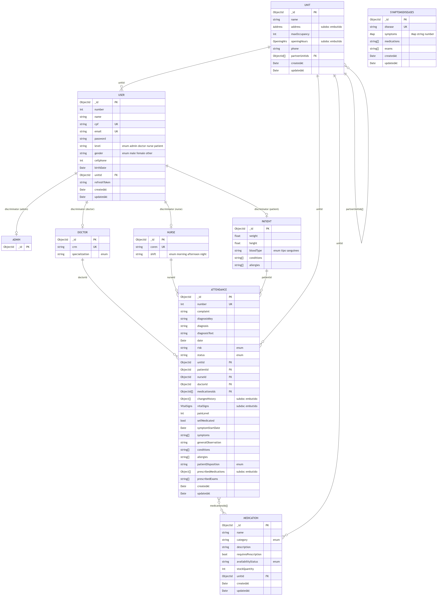

# 2.5 Modelagem de Banco de Dados — MedIT

> Documento de modelagem do banco de dados do MedIT, alinhado ao código real do repositório (backend Mongoose / MongoDB).
>
> **Importante:** o MedIT utiliza **MongoDB** (NoSQL orientado a documentos) com Mongoose. Para fins acadêmicos, as coleções são apresentadas neste documento como **tabelas** com seus campos, tipos e restrições. Quando uma coleção possui **subdocumentos embutidos** (estruturas aninhadas dentro do mesmo documento), eles são apresentados em tabelas próprias com a indicação `(embutido em ...)`.
>
> O modelo de **usuários** utiliza o padrão **Discriminator** do Mongoose: existe uma única coleção física `User` que armazena administradores, médicos, enfermeiros e pacientes; o campo `level` atua como discriminador e habilita os campos específicos de cada perfil. Por isso, neste documento, `Admin`, `Doctor`, `Nurse` e `Patient` são apresentados como **especializações** (herança ISA) da entidade `User`.

---

## 2.5.1 Tabelas (Coleções)

### Tabela "User" (coleção base — pai dos perfis)

Coleção física que armazena **todos os usuários** do sistema. Os campos a seguir são comuns a `Admin`, `Doctor`, `Nurse` e `Patient` (especializações via discriminator pelo campo `level`).

| Campo          | Descrição                                                       | Tipo Dado    | Nulo | Consistência       |
|----------------|------------------------------------------------------------------|--------------|------|--------------------|
| _id            | Identificador único do usuário                                   | ObjectId PK  | Não  | Chave primária     |
| number         | Numeração sequencial por nível (gerada automaticamente)         | INT          | Sim  | Único              |
| name           | Nome completo (mínimo nome + sobrenome)                          | VARCHAR(100) | Não  | -                  |
| cpf            | CPF do usuário (apenas dígitos, 11 caracteres)                   | VARCHAR(11)  | Não  | Único              |
| email          | E-mail do usuário                                                 | VARCHAR(100) | Não  | Único              |
| password       | Senha criptografada (bcrypt)                                      | VARCHAR(255) | Não  | Mínimo 6 caracteres|
| level          | Nível de acesso (discriminator do perfil)                         | ENUM         | Não  | Domínio: admin / doctor / nurse / patient |
| gender         | Gênero                                                            | ENUM         | Sim  | Domínio: male / female / other |
| cellphone      | Telefone celular                                                  | INT          | Sim  | -                  |
| birthDate      | Data de nascimento                                                | DATE         | Sim  | -                  |
| unitId         | Referência à unidade vinculada ao usuário                         | ObjectId     | Sim  | FK → Unit          |
| refreshToken   | Token JWT de renovação de sessão                                  | TEXT         | Sim  | -                  |
| createdAt      | Data de criação do registro                                       | DATETIME     | Não  | Gerado automaticamente |
| updatedAt      | Data da última atualização                                        | DATETIME     | Não  | Gerado automaticamente |

---

### Tabela "Patient" (especialização de User; level = "patient")

Adiciona aos campos de `User` os atributos clínicos básicos do paciente.

| Campo       | Descrição                                  | Tipo Dado | Nulo | Consistência       |
|-------------|--------------------------------------------|-----------|------|--------------------|
| weight      | Peso corporal (kg)                         | FLOAT     | Sim  | -                  |
| height      | Altura (m)                                 | FLOAT     | Sim  | -                  |
| bloodType   | Tipo sanguíneo                             | ENUM      | Sim  | Domínio: A+, A-, B+, B-, AB+, AB-, O+, O- |
| conditions  | Condições médicas pré-existentes (lista)   | TEXT[]    | Sim  | -                  |
| allergies   | Alergias conhecidas (lista)                | TEXT[]    | Sim  | -                  |

---

### Tabela "Doctor" (especialização de User; level = "doctor")

| Campo          | Descrição                       | Tipo Dado    | Nulo | Consistência       |
|----------------|---------------------------------|--------------|------|--------------------|
| crm            | Registro profissional médico    | VARCHAR(20)  | Não  | Único              |
| specialization | Especialização médica           | ENUM         | Não  | Domínio: cardiology, dermatology, neurology, pediatrics, psychiatry, orthopedics, gynecology, ophthalmology, otolaryngology, radiology, anesthesiology, emergency_medicine, endocrinology, gastroenterology, hematology, infectious_diseases, nephrology, pulmonology, rheumatology, urology, other |

---

### Tabela "Nurse" (especialização de User; level = "nurse")

| Campo  | Descrição                                  | Tipo Dado    | Nulo | Consistência       |
|--------|--------------------------------------------|--------------|------|--------------------|
| coren  | Registro profissional de enfermagem        | VARCHAR(20)  | Não  | Único              |
| shift  | Turno de trabalho                          | ENUM         | Não  | Domínio: morning / afternoon / night |

---

### Tabela "Admin" (especialização de User; level = "admin")

Não acrescenta campos próprios; herda integralmente os atributos de `User`. O escopo administrativo de uma unidade é dado pelo campo `unitId` da tabela base.

---

### Tabela "Unit"

Representa uma unidade hospitalar/UBS/UPA cadastrada no sistema. Possui dois subdocumentos embutidos (`Address` e `OpeningHours`).

| Campo            | Descrição                                                       | Tipo Dado     | Nulo | Consistência       |
|------------------|------------------------------------------------------------------|---------------|------|--------------------|
| _id              | Identificador único da unidade                                   | ObjectId PK   | Não  | Chave primária     |
| name             | Nome da unidade                                                   | VARCHAR(100)  | Não  | Mínimo 2 caracteres|
| address          | Endereço da unidade                                               | Address       | Não  | Subdocumento embutido |
| maxOccupancy     | Capacidade máxima de ocupação                                     | INT           | Não  | Mínimo 1           |
| openingHours     | Horários de funcionamento por dia da semana                       | OpeningHours  | Sim  | Subdocumento embutido |
| phone            | Telefone da unidade                                               | VARCHAR(11)   | Sim  | 10 ou 11 dígitos numéricos |
| partnerUnitIds   | Referências a unidades parceiras (rede de consulta de medicamentos) | ObjectId[]  | Sim  | FK → Unit          |
| createdAt        | Data de criação                                                   | DATETIME      | Não  | Gerado automaticamente |
| updatedAt        | Data da última atualização                                        | DATETIME      | Não  | Gerado automaticamente |

---

### Subdocumento "Address" (embutido em Unit)

| Campo        | Descrição          | Tipo Dado    | Nulo | Consistência |
|--------------|--------------------|--------------|------|--------------|
| street       | Logradouro         | VARCHAR(150) | Sim  | -            |
| number       | Número             | INT          | Sim  | -            |
| neighborhood | Bairro             | VARCHAR(100) | Sim  | -            |
| city         | Cidade             | VARCHAR(100) | Sim  | -            |
| state        | Estado (UF)        | VARCHAR(2)   | Sim  | -            |
| zipCode      | CEP (somente números) | INT       | Sim  | -            |

---

### Subdocumento "OpeningHours" (embutido em Unit)

Estrutura do tipo `Map<WeekDay, { open, close } | null>`, em que `WeekDay` é um dia da semana (`mon`, `tue`, `wed`, `thu`, `fri`, `sat`, `sun`). Cada chave aponta para um par de horários (formato `HH:MM`) ou `null` quando a unidade não opera no dia.

| Campo  | Descrição                          | Tipo Dado    | Nulo | Consistência       |
|--------|------------------------------------|--------------|------|--------------------|
| open   | Horário de abertura (HH:MM)        | VARCHAR(5)   | Não  | Formato HH:MM      |
| close  | Horário de fechamento (HH:MM)      | VARCHAR(5)   | Não  | Formato HH:MM      |

---

### Tabela "Attendance"

Documento principal do fluxo clínico-operacional. Substitui a antiga "Appointment" do TCC e centraliza queixa, sinais vitais, status do fluxo, vínculos profissionais e dados do encerramento médico.

| Campo                  | Descrição                                                              | Tipo Dado          | Nulo | Consistência       |
|------------------------|------------------------------------------------------------------------|--------------------|------|--------------------|
| _id                    | Identificador único do atendimento                                     | ObjectId PK        | Não  | Chave primária     |
| number                 | Numeração sequencial do atendimento                                    | INT                | Sim  | Único              |
| complaint              | Queixa principal do paciente                                            | TEXT               | Não  | -                  |
| diagnosisKey           | Chave da doença diagnosticada (referência à base SymptomsDiseases)      | VARCHAR(100)       | Sim  | -                  |
| diagnosis              | Diagnóstico (rótulo padrão)                                             | TEXT               | Sim  | -                  |
| diagnosisText          | Texto livre complementar do diagnóstico                                  | TEXT               | Sim  | -                  |
| date                   | Data/hora do atendimento                                                | DATETIME           | Não  | Default: agora     |
| risk                   | Classificação de risco                                                   | ENUM               | Não  | Domínio: emergency, veryUrgent, urgent, lessUrgent, notUrgent |
| status                 | Status atual do fluxo                                                    | ENUM               | Não  | Domínio: onTheWay, waitingTriage, inTriage, triageCompleted, waitingAttendance, inAttendance, attendanceCompleted, canceled, completed |
| unitId                 | Referência à unidade do atendimento                                      | ObjectId           | Não  | FK → Unit          |
| patientId              | Referência ao paciente                                                   | ObjectId           | Não  | FK → User (Patient)|
| nurseId                | Referência ao(à) enfermeiro(a) responsável pela triagem                 | ObjectId           | Sim  | FK → User (Nurse)  |
| doctorId               | Referência ao(à) médico(a) responsável pela consulta                    | ObjectId           | Sim  | FK → User (Doctor) |
| medicationsIds         | Medicamentos vinculados ao atendimento                                   | ObjectId[]         | Sim  | FK → Medication (n×n) |
| changesHistory         | Histórico de mudanças de status                                          | ChangeEntry[]      | Sim  | Subdocumento embutido |
| vitalSigns             | Sinais vitais coletados na triagem                                       | VitalSigns         | Sim  | Subdocumento embutido |
| painLevel              | Nível de dor relatado (0–10)                                             | INT                | Sim  | -                  |
| selfMedicated          | Indica se o paciente se automedicou                                      | BOOLEAN            | Sim  | -                  |
| symptomStartDate       | Data de início dos sintomas                                              | DATE               | Sim  | -                  |
| symptoms               | Sintomas relatados (lista de chaves/rótulos)                            | VARCHAR(50)[]      | Sim  | -                  |
| generalObservation     | Observações gerais (texto livre)                                         | TEXT               | Sim  | -                  |
| conditions             | Condições do paciente registradas no episódio                           | TEXT[]             | Sim  | -                  |
| allergies              | Alergias registradas no episódio                                         | TEXT[]             | Sim  | -                  |
| patientDisposition     | Destino do paciente após o atendimento                                   | ENUM               | Sim  | Domínio: hospitalized, home, observation, transfer |
| prescribedMedications  | Medicamentos prescritos no encerramento                                  | PrescribedMed[]    | Sim  | Subdocumento embutido |
| prescribedExams        | Exames prescritos no encerramento                                        | VARCHAR(150)[]     | Sim  | -                  |
| createdAt              | Data de criação                                                          | DATETIME           | Não  | Gerado automaticamente |
| updatedAt              | Data da última atualização                                               | DATETIME           | Não  | Gerado automaticamente |

---

### Subdocumento "VitalSigns" (embutido em Attendance)

| Campo            | Descrição                                  | Tipo Dado    | Nulo | Consistência |
|------------------|--------------------------------------------|--------------|------|--------------|
| bloodPressure    | Pressão arterial (ex.: "120/80")           | VARCHAR(10)  | Sim  | -            |
| heartRate        | Frequência cardíaca (bpm)                  | INT          | Sim  | -            |
| temperature      | Temperatura corporal (°C)                  | FLOAT        | Sim  | -            |
| oxygenSaturation | Saturação de oxigênio (SpO₂, %)            | INT          | Sim  | -            |

---

### Subdocumento "ChangeEntry" (embutido em Attendance.changesHistory[])

| Campo      | Descrição                              | Tipo Dado | Nulo | Consistência |
|------------|----------------------------------------|-----------|------|--------------|
| status     | Status registrado nesta transição      | ENUM      | Não  | Domínio: AttendanceStatus |
| changedAt  | Data/hora da mudança                   | DATETIME  | Não  | Default: agora |

---

### Subdocumento "PrescribedMedication" (embutido em Attendance.prescribedMedications[])

| Campo        | Descrição                                  | Tipo Dado    | Nulo | Consistência |
|--------------|--------------------------------------------|--------------|------|--------------|
| name         | Nome do medicamento prescrito              | VARCHAR(100) | Não  | -            |
| dosage       | Dosagem (ex.: "500 mg")                    | VARCHAR(50)  | Sim  | -            |
| frequency    | Frequência (ex.: "8 em 8 horas")           | VARCHAR(50)  | Sim  | -            |
| duration     | Duração do tratamento                      | VARCHAR(50)  | Sim  | -            |
| observation  | Observação adicional (texto livre)         | TEXT         | Sim  | -            |

---

### Tabela "Medication"

Estoque de medicamentos da unidade. Cada medicamento pertence a **uma** unidade — unidades diferentes possuem catálogos e quantidades distintas.

| Campo                | Descrição                                       | Tipo Dado    | Nulo | Consistência       |
|----------------------|--------------------------------------------------|--------------|------|--------------------|
| _id                  | Identificador único do medicamento               | ObjectId PK  | Não  | Chave primária     |
| name                 | Nome do medicamento                              | VARCHAR(100) | Não  | Mínimo 2 caracteres|
| category             | Categoria farmacológica                          | ENUM         | Não  | Domínio: analgesics, antibiotics, antivirals, antifungals, anticonvulsants, antidepressants, antipsicoticos, antiseptics, antivenoms, other |
| description          | Descrição do medicamento                         | TEXT         | Não  | -                  |
| requiresPrescription | Exige receita médica?                            | BOOLEAN      | Não  | Default: false     |
| availabilityStatus   | Status de disponibilidade                        | ENUM         | Não  | Domínio: available / low_stock / unavailable |
| stockQuantity        | Quantidade em estoque                            | INT          | Não  | ≥ 0                |
| unitId               | Referência à unidade onde o estoque é mantido    | ObjectId     | Não  | FK → Unit          |
| createdAt            | Data de criação                                  | DATETIME     | Não  | Gerado automaticamente |
| updatedAt            | Data da última atualização                       | DATETIME     | Não  | Gerado automaticamente |

---

### Tabela "SymptomsDiseases"

Base curada que sustenta o mecanismo inteligente de sugestão de doenças (IA simbólica baseada em regras). Cada documento descreve **uma doença** e o conjunto ponderado de sintomas que caracteriza o quadro.

| Campo        | Descrição                                                   | Tipo Dado          | Nulo | Consistência       |
|--------------|-------------------------------------------------------------|--------------------|------|--------------------|
| _id          | Identificador único do registro                              | ObjectId PK        | Não  | Chave primária     |
| disease      | Nome da doença                                               | VARCHAR(150)       | Não  | Único              |
| symptoms     | Sintomas e respectivos pesos (mapa chave → peso)             | Map<string, INT>   | Não  | Pesos numéricos (≤ 0 são ignorados na pontuação) |
| medications  | Medicamentos sugeridos (curados)                             | VARCHAR(150)[]     | Sim  | Default: []        |
| exams        | Exames sugeridos (curados)                                   | VARCHAR(150)[]     | Sim  | Default: []        |
| createdAt    | Data de criação                                              | DATETIME           | Não  | Gerado automaticamente |
| updatedAt    | Data da última atualização                                   | DATETIME           | Não  | Gerado automaticamente |

---

## 2.5.2 Diagrama Entidade-Relacionamento (DER)

A figura abaixo apresenta o DER do MedIT. Os usuários (`Admin`, `Doctor`, `Nurse` e `Patient`) compartilham a coleção física `User` por meio do padrão **discriminator** do Mongoose, daí serem modelados como especializações ISA da entidade base `User`.

### Relacionamentos

| Origem      | Cardinalidade | Destino     | Atributo de ligação | Observação |
|-------------|---------------|-------------|---------------------|------------|
| User        | 1 : 0..1      | Admin       | level = "admin"     | Especialização (discriminator) |
| User        | 1 : 0..1      | Doctor      | level = "doctor"    | Especialização (discriminator) |
| User        | 1 : 0..1      | Nurse       | level = "nurse"     | Especialização (discriminator) |
| User        | 1 : 0..1      | Patient     | level = "patient"   | Especialização (discriminator) |
| Unit        | 1 : N         | User        | `unitId`            | Vinculação do usuário à unidade |
| Unit        | 1 : N         | Attendance  | `unitId`            | Atendimentos pertencem a uma unidade |
| Unit        | 1 : N         | Medication  | `unitId`            | Estoque por unidade |
| Unit        | N : N         | Unit        | `partnerUnitIds[]`  | Rede de unidades parceiras (consulta cruzada de medicamentos) |
| Patient     | 1 : N         | Attendance  | `patientId`         | Histórico clínico do paciente |
| Nurse       | 1 : N         | Attendance  | `nurseId`           | Atendimentos triados pelo enfermeiro |
| Doctor      | 1 : N         | Attendance  | `doctorId`          | Atendimentos conduzidos pelo médico |
| Attendance  | N : N         | Medication  | `medicationsIds[]`  | Medicamentos utilizados/dispensados |

> O subdocumento `prescribedMedications[]` em `Attendance` armazena prescrições **textuais** (nome, dosagem, frequência, etc.) e **não** referencia `Medication`; o vínculo com a tabela `Medication` (estoque) ocorre apenas via `medicationsIds[]`.

---

## 2.5.3 Notas de modelagem

- **MongoDB / Mongoose:** o sistema usa MongoDB com Mongoose 9. Em vez de uma tabela associativa `Appointment_Medication`, o relacionamento N : N entre `Attendance` e `Medication` é representado por um **array de referências** (`medicationsIds: ObjectId[]`) dentro do próprio documento de atendimento.
- **Discriminator de usuários:** `Admin`, `Doctor`, `Nurse` e `Patient` coexistem na mesma coleção `User` e são distinguidos pelo campo `level`. As consultas filtradas por nível usam esse campo como condição.
- **Subdocumentos embutidos:** `Address`, `OpeningHours`, `VitalSigns`, `ChangeEntry` e `PrescribedMedication` são estruturas armazenadas dentro do documento pai (sem coleção própria). Optou-se por embutir esses dados pois são acessados quase sempre junto do documento principal e dependem do ciclo de vida dele.
- **Numeração sequencial (`number`):** tanto `User` quanto `Attendance` mantêm um contador sequencial (escopo: por nível em `User`; global em `Attendance`) gerado por *hooks* `pre('save')` para apresentação ao usuário (ex.: número de protocolo).
- **Senhas:** `User.password` é armazenada com **hash bcrypt** (gerada em `pre('save')`) e omitida em respostas via `toJSON.transform`.
- **Indexação:** unicidade declarada em `cpf`, `email`, `User.number`, `Doctor.crm`, `Nurse.coren`, `Attendance.number` e `SymptomsDiseases.disease`.
- **Timestamps automáticos:** todas as coleções principais usam `{ timestamps: true }`, gerando automaticamente `createdAt` e `updatedAt`.
